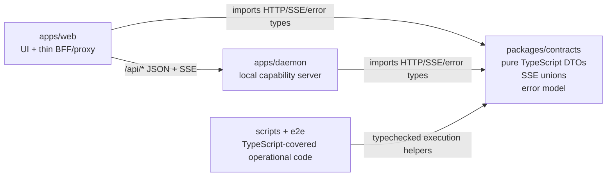

## 概览

### 问题陈述

`apps/web` 和 `apps/daemon` 需要实现下一批 maintainability-roadmap 工作流：`specs/current/maintainability-roadmap.md` 中的 W2 和 W3。本 spec 以把整个项目迁移到 TypeScript 作为最终状态；实现计划仍可采用增量步骤，让每一步都易于验证。

### 目标

- 实现 W2：定义覆盖 R2、R7 和 R8 的共享 API、SSE 与错误 contract。
- 将 W3 实现为项目自有 JavaScript entrypoints、modules、scripts、tests 和 reporters 的完整 TypeScript 迁移，覆盖 R1 以及仓库内相关的 maintainability 风险。
- 提供可由 web 和 daemon 代码共同导入的共享 request/response types、SSE event union 和 error model。
- 配置 TypeScript，让所有已迁移的项目代码被一致检查，并按安全验证顺序安排迁移步骤。

### 范围

- 创建或更新 web/daemon request、response、error 和 SSE event types 的共享 contract layer。
- 添加将 daemon、仓库 scripts 和测试支持代码迁移到 TypeScript 所需的 TypeScript 配置与 package/script 集成。
- 保持 roadmap 中既有的 architecture boundary：`apps/web` 仍是 Next.js frontend 和轻量 BFF/proxy layer；`apps/daemon` 仍是本地 runtime/backend。

### 约束

- W2 依赖已完成的 W1 ownership 与 capability boundaries。
- W3 应基于 W2，以便复用最高价值的共享 types。
- Runtime validation、server modularization、process/task manager 工作，以及更宽的 daemon test pyramid 工作属于后续 roadmap workstreams。

### 成功标准

- Web 和 daemon 可以导入同一套 contract types。
- 项目自有 source、scripts、tests 和 reporters 有一条通向 typed end state 的 TypeScript 迁移路径。
- Typecheck 覆盖本 spec 中包含的 shared contracts、web、daemon、scripts 和测试支持代码。
- 新 contracts 明确覆盖 HTTP payloads、SSE events 和统一 error model。

## 调研

### 现有系统

- W2 覆盖隐式 web/daemon API contract、不一致的错误处理，以及规范不足的 SSE protocol；roadmap 的 W3 文本把 daemon TypeScript 支持列为原始产出。Source: `specs/current/maintainability-roadmap.md:57-58`
- W1 将共享边界定义为 web 和 daemon 都可使用的纯 JavaScript 或 TypeScript，允许共享的内容包括 API DTO types、runtime schemas、task states、SSE event names 和 error codes。Source: `specs/current/architecture-boundaries.md:41-56`
- `apps/web` 通过 API DTOs 和 streaming events 与 daemon-owned capabilities 通信；特权本地 filesystem、SQLite、agent CLI、task lifecycle、logs 和 artifacts 仍归 daemon 所有。Source: `specs/current/architecture-boundaries.md:13-40`
- workspace 目前没有 `packages/*` workspace entries；`pnpm-workspace.yaml` 只包含 `apps/*` 和 `e2e`。Source: `pnpm-workspace.yaml:1-3`
- `packages/*` 下目前不存在共享 package。Source: file search `packages/*/package.json`
- Root scripts 通过 pnpm filters 运行 daemon、web、build、tests 和 typecheck；root `typecheck` 目前只针对 `@open-design/web`。Source: `package.json:12-25`
- Dev-mode web 会把 `/api/*`、`/artifacts/*` 和 `/frames/*` rewrite 到本地 daemon origin；配置中说明 `/api/chat` SSE streams 会通过 rewrite。Source: `apps/web/next.config.ts:35-44`
- Web 侧 daemon chat types 位于 `apps/web/src/providers/daemon.ts`：`DaemonStreamOptions` 发送 `agentId`、`history`、`systemPrompt`、`projectId`、`attachments`、`model` 和 `reasoning`。Source: `apps/web/src/providers/daemon.ts:19-38`
- Web chat client 以 JSON fields `agentId`、`systemPrompt`、`message`、`projectId`、`attachments`、`model` 和 `reasoning` POST 到 `/api/chat`。Source: `apps/web/src/providers/daemon.ts:57-77`
- Daemon `/api/chat` handler 从 `req.body` 读取同一批 request fields，以 ad hoc 方式校验 agent 和 message，并在 invalid agent、missing binary 或 missing message 时返回 HTTP 400 JSON errors。Source: `apps/daemon/src/server.ts:868-884`
- Web 侧 `AgentEvent` 目前把 UI events 建模为 `status`、`text`、`thinking`、`tool_use`、`tool_result`、`usage` 和 `raw`。Source: `apps/web/src/types.ts:32-39`
- Daemon SSE setup for `/api/chat` 会写入带 `event: <name>` 和 JSON `data` 的 `text/event-stream` frames，使用 `start`、`agent`、`stdout`、`stderr`、`error` 和 `end` 等 events。Source: `apps/daemon/src/server.ts:1035-1044`, `apps/daemon/src/server.ts:1087-1095`, `apps/daemon/src/server.ts:1136-1180`
- Web SSE parser 消费 frame separators，解析 event/data fields，将 `stdout` 映射为 text，缓冲 `stderr`，转换 `agent` payloads，处理 `start`，把 `error` 当作 terminal，并读取 `end` exit code。Source: `apps/web/src/providers/daemon.ts:85-151`
- Web translation 接受 daemon `agent` payload types `status`、`text_delta`、`thinking_delta`、`thinking_start`、`tool_use`、`tool_result`、`usage` 和 `raw`；未知 payloads 会被忽略。Source: `apps/web/src/providers/daemon.ts:178-228`
- Agent JSON event parsing 会发出 normalized events，例如 `status`、`text_delta`、`tool_use`、`tool_result`、`usage` 和 `raw`；OpenCode error payloads 目前会变成一个嵌入 error text 的 `raw` event。Source: `apps/daemon/src/json-event-stream.ts:35-91`
- Daemon API proxy 有一个独立 SSE endpoint `/api/proxy/stream`，request fields 为 `baseUrl`、`apiKey`、`model`、`systemPrompt` 和 `messages`，并返回 `start`、`delta`、`error` 和 `end` SSE events。Source: `apps/daemon/src/server.ts:1188-1192`, `apps/daemon/src/server.ts:1241-1250`, `apps/daemon/src/server.ts:1262-1275`, `apps/daemon/src/server.ts:1291-1303`
- HTTP error responses 是 ad hoc 的：project routes 往往返回 `{ error: string }`，upload errors 返回 `{ code, error }`，preview errors 根据 status 派生 `{ error }`。Source: `apps/daemon/src/server.ts:200-205`, `apps/daemon/src/server.ts:147-177`, `apps/daemon/src/server.ts:755-763`
- Project CRUD 与 conversation/message routes 形成常见 response envelopes，例如 `{ projects }`、`{ project, conversationId }`、`{ project }`、`{ conversations }`、`{ conversation }` 和 `{ messages }`。Source: `apps/daemon/src/server.ts:200-269`, `apps/daemon/src/server.ts:325-424`
- File routes 形成常见 response envelopes，例如 `{ files }`、`{ file }` 和 `{ ok: true }`；raw file routes 返回 binary data。Source: `apps/daemon/src/server.ts:725-752`, `apps/daemon/src/server.ts:776-833`, `apps/daemon/src/server.ts:840-864`
- `apps/daemon/src/projects.ts` 负责 project file DTO construction，字段包括 `name`、`path`、`type`、`size`、`mtime`、`kind`、`mime`、`artifactKind` 和 `artifactManifest`。Source: `apps/daemon/src/projects.ts:30-70`
- Web application types 已包含 daemon-adjacent DTOs，例如 `AgentInfo`、`ProjectFileKind`、`ProjectFile`、`Project`，以及 `apps/web/src/types.ts` 中的 chat attachment/message/event types。Source: `apps/web/src/types.ts:41-101`, `apps/web/src/types.ts:150-160`
- `apps/web` 已配置 TypeScript，启用 `strict`、`noUncheckedIndexedAccess`、`allowJs`、`noEmit`，并通过 `tsc -b --noEmit` 的 `typecheck` script 检查。Source: `apps/web/tsconfig.json:2-23`, `apps/web/package.json:6-10`
- `apps/daemon` 是 ESM，通过 `node cli.js` 启动，用 `vitest run -c vitest.config.ts` 测试，目前没有 `typecheck` script。Source: `apps/daemon/package.json:1-23`
- Daemon test config 是 TypeScript，并在 Node test environment 下包含 `**/*.test.{ts,tsx,js,mjs,cjs}`。Source: `apps/daemon/vitest.config.ts:1-8`
- `apps/daemon` 目前同时包含 JavaScript/MJS project code 和 TypeScript test/config files：`cli.js`、`server.js`、`db.js`、`agents.js`、stream parsers、project/design-system helpers、artifact helpers、`json-event-stream.test.mjs`、`artifact-manifest.test.ts` 和 `vitest.config.ts`。Source: file search `apps/daemon/**/*.{js,mjs,cjs,ts,tsx}`
- `apps/web` source 与 config files 是 TypeScript/TSX，包括 `next.config.ts`、`app/**/*.tsx`、`src/**/*.ts`、`src/**/*.tsx` 和 `vitest.config.ts`。Source: file search `apps/web/**/*.{js,mjs,cjs,ts,tsx}`
- `e2e` 是混合状态：Playwright 和 Vitest config/tests 是 TypeScript，而 runtime/support scripts 与 reporters 包含 `.mjs` 和 `.cjs` files。Source: `e2e/package.json:6-12`, `e2e/playwright.config.ts:1-58`, `e2e/vitest.config.ts:1-12`, file search `e2e/**/*.{js,mjs,cjs,ts,tsx}`
- Root scripts 目前是 MJS files：`scripts/resolve-dev-ports.mjs`、`scripts/dev-all.mjs` 和 `scripts/sync-design-systems.mjs`。Source: file search `scripts/**/*.{js,mjs,cjs,ts,tsx}`

### 可用方案

- **添加新的共享 workspace package**：为 contracts 创建一个 workspace package，并加入 pnpm workspace，让 `apps/web` 和 `apps/daemon` 都能导入纯共享 TypeScript。这匹配 roadmap 的 shared contract layer 产出和 W1 shared-boundary rules。Source: `specs/current/maintainability-roadmap.md:57-58`, `specs/current/architecture-boundaries.md:41-56`, `pnpm-workspace.yaml:1-3`
- **把 shared contracts 放在现有 app 内部**：将 contract types 移到 `apps/web` 下可以复用很多当前 UI-adjacent types，但 W1 要求 shared code 只包含纯 DTOs，并避免 framework 或 environment-specific APIs。Source: `apps/web/src/types.ts:32-101`, `specs/current/architecture-boundaries.md:41-56`
- **从 type-only contracts 开始**：W2 可以先定义 request/response、SSE event 和 error model types，而 runtime schemas 留给后续 W4 workstream。Source: `specs/current/maintainability-roadmap.md:57-60`
- **分阶段迁移仓库代码到 typed end state**：W3 可以先添加 TypeScript configs 和 package scripts，然后以有边界的批次转换 daemon modules、root scripts 和 e2e support files，每个批次之后运行 typecheck/test 验证。Source: `apps/daemon/package.json:9-13`, `apps/daemon/vitest.config.ts:1-8`, `e2e/package.json:6-12`, file search `apps/daemon/**/*.{js,mjs,cjs,ts,tsx}`, file search `scripts/**/*.{js,mjs,cjs,ts,tsx}`
- **扩大 root typecheck**：root `typecheck` 目前只针对 web，因此完整项目 TypeScript 验证需要覆盖 daemon、shared package、scripts 和 e2e/support。Source: `package.json:23`, `apps/daemon/package.json:9-13`, `e2e/package.json:6-12`

### 约束与依赖

- W2 依赖已完成的 W1 ownership boundaries，W3 依赖 W2 以获得最高价值的 shared types。Source: `specs/current/maintainability-roadmap.md:56-58`
- HTTP inputs、paths、agents、models、uploads、task IDs 和 command args 的 runtime validation 属于 W4 范围，因此 W2/W3 research 应捕获 type boundaries，而不是现在实现完整 validation policy。Source: `specs/current/maintainability-roadmap.md:59`
- Shared code 必须不包含 Next.js、Express、Node filesystem/process APIs、browser APIs、SQLite 和 daemon internals。Source: `specs/current/architecture-boundaries.md:41-56`
- API DTOs 应优先使用 workspace-scoped logical paths 或 relative paths；machine absolute paths 应保持为 daemon-internal。Source: `specs/current/architecture-boundaries.md:58-64`
- `/api/chat` stream 当前在 `start` SSE event 中包含 daemon-internal `cwd`。Source: `apps/daemon/src/server.ts:1087-1095`
- 当前 daemon SSE lifecycle 在 emitted events 中没有 heartbeat 或 version field。Source: `apps/daemon/src/server.ts:1035-1044`, `apps/daemon/src/server.ts:1087-1180`
- 当前 error responses 和 SSE errors 没有使用包含 `code`、`message`、`details`、`retryable` 和 `requestId/taskId` 的统一 model。Source: `apps/daemon/src/server.ts:147-177`, `apps/daemon/src/server.ts:200-205`, `apps/daemon/src/server.ts:868-884`, `apps/daemon/src/server.ts:1170-1180`
- Daemon package devDependencies 目前只包含 `vitest`；TypeScript 以及 Node/Express type packages 在 web 中可用，但 daemon 中没有。Source: `apps/daemon/package.json:21-23`, `apps/web/package.json:19-24`
- Full-project TypeScript migration 包含 CommonJS/MJS operational edges，例如 Playwright reporter loading 和 Node test/script execution。Source: `e2e/playwright.config.ts:22-37`, `e2e/package.json:8-12`, `package.json:14-15`

### 关键参考

- `specs/current/maintainability-roadmap.md:57-58` - W2/W3 outputs 与 dependency relationship。
- `specs/current/architecture-boundaries.md:41-56` - 允许的 shared contract contents 和 shared-code restrictions。
- `apps/web/next.config.ts:35-44` - web-to-daemon API 与 SSE 的 dev proxy boundary。
- `apps/web/src/providers/daemon.ts:19-38` - web 侧 `/api/chat` request options。
- `apps/web/src/providers/daemon.ts:85-151` - web 侧 SSE frame handling。
- `apps/web/src/providers/daemon.ts:178-228` - web 侧 daemon agent event translation。
- `apps/web/src/types.ts:32-39` - 当前 UI `AgentEvent` union。
- `apps/daemon/src/server.ts:868-884` - daemon `/api/chat` request field handling 与 ad hoc HTTP errors。
- `apps/daemon/src/server.ts:1035-1044` - daemon SSE frame writer。
- `apps/daemon/src/server.ts:1087-1180` - daemon `/api/chat` start/agent/stdout/stderr/error/end lifecycle。
- `apps/daemon/src/server.ts:1188-1303` - daemon API proxy stream request 与 SSE events。
- `apps/daemon/src/json-event-stream.ts:35-91` - normalized agent JSON event output。
- `apps/daemon/package.json:9-23` - daemon scripts 与 dependencies。
- `apps/web/tsconfig.json:2-23` - web TypeScript baseline。
- `e2e/package.json:6-12` - e2e test scripts，目前会执行 TS config 和 MJS runtime support。
- `pnpm-workspace.yaml:1-3` - 当前 workspace package globs。

## 设计

### 架构概览

### 设计决策

- Decision: 为 W2 添加新的 `packages/contracts` workspace package。该 package 导出 daemon HTTP DTOs、SSE event unions、task states 和 error codes 的纯 TypeScript types；这符合 shared-boundary 允许内容和 roadmap 的 shared-contract output。Source: `specs/current/architecture-boundaries.md:41-56`, `specs/current/maintainability-roadmap.md:57-58`, `pnpm-workspace.yaml:1-3`
- Decision: 保留 `apps/web/src/types.ts` 作为 UI/application type layer，只把 daemon-facing DTOs/events/errors 移入 `packages/contracts`。Web 拥有 UI state，并通过 API DTOs 和 streaming events 与 daemon 通信；当前 UI `AgentEvent` 是 presentation union。Source: `specs/current/architecture-boundaries.md:13-27`, `apps/web/src/types.ts:32-39`, `apps/web/src/types.ts:150-179`, `apps/web/src/types.ts:215-252`
- Decision: 在收紧行为之前先为当前 daemon API 建模。先为 `/api/chat`、`/api/proxy/stream`、project routes、conversation/message routes、file routes、artifacts、health、agents、skills 和 design systems 定义 type contracts，再在 W4 中添加 runtime schemas。Source: `specs/current/maintainability-roadmap.md:57-60`, `apps/daemon/src/server.ts:200-269`, `apps/daemon/src/server.ts:725-864`, `apps/daemon/src/server.ts:868-884`, `apps/daemon/src/server.ts:1188-1303`
- Decision: 定义独立的 transport-level SSE unions 和 UI-level event unions。`/api/chat` transport events 覆盖 `start`、`agent`、`stdout`、`stderr`、`error` 和 `end`；normalized agent payloads 覆盖 `status`、`text_delta`、`thinking_delta`、`thinking_start`、`tool_use`、`tool_result`、`usage` 和 `raw`；web translation 为 forward compatibility 保持宽松。Source: `apps/daemon/src/server.ts:1035-1044`, `apps/daemon/src/server.ts:1087-1180`, `apps/web/src/providers/daemon.ts:85-151`, `apps/web/src/providers/daemon.ts:178-228`, `apps/daemon/src/json-event-stream.ts:35-91`
- Decision: 为未来 W8/W6 compatibility 定义 versioned SSE contract shape，同时在 W2 adoption 期间保留现有 event names。包含 protocol version constant 和 typed event payloads；heartbeat、cancellation 和 canonical task lifecycle events 保持为未来扩展。Source: `specs/current/maintainability-roadmap.md:40-41`, `specs/current/maintainability-roadmap.md:57-64`, `apps/daemon/src/server.ts:1035-1044`, `apps/daemon/src/server.ts:1087-1180`
- Decision: 引入统一的 `ApiError` 和 `SseErrorEvent` type，包含 `code`、`message`、`details`、`retryable`、`requestId` 和 `taskId`，并为现有 `{ error }` 与 `{ code, error }` responses 提供 compatibility helpers。当前 routes 返回多种 ad hoc shapes；W2 应明确目标 contract。Source: `specs/current/maintainability-roadmap.md:39-40`, `apps/daemon/src/server.ts:147-177`, `apps/daemon/src/server.ts:200-205`, `apps/daemon/src/server.ts:868-884`, `apps/daemon/src/server.ts:1170-1180`
- Decision: 在 public contracts 中把 machine absolute paths 视为 daemon-internal。DTOs 应使用 project-relative 或 logical paths；现有 `/api/chat` `start` event 的 `cwd` field 应标为 legacy/internal，并在 adoption 期间从 web-facing assumptions 中移除。Source: `specs/current/architecture-boundaries.md:58-64`, `apps/daemon/src/server.ts:1087-1095`
- Decision: W3 的最终状态是 compiled TypeScript daemon runtime，并带有 transitional `allowJs` phase。Daemon 目前运行 `node cli.js`，并把 `./cli.js` 作为 bin 暴露，因此 TypeScript entrypoint migration 需要有意设计 build output 和 script/bin update。Source: `apps/daemon/package.json:6-13`, `package.json:9-24`
- Decision: 将 typechecking 从仅 web 扩展到 contracts、daemon、scripts 和 e2e support。Root `typecheck` 当前只过滤 `@open-design/web`；daemon 有 tests 但没有 typecheck script；e2e 已使用 TypeScript configs 和 MJS/CJS operational files。Source: `package.json:19-25`, `apps/daemon/package.json:9-23`, `apps/web/tsconfig.json:2-23`, `e2e/package.json:6-12`, `e2e/playwright.config.ts:1-58`
- Decision: 按依赖顺序迁移 JavaScript/MJS/CJS files：pure parsers/helpers、project/artifact helpers、DB/agent modules、server/CLI entrypoints、root scripts，最后是 e2e scripts/reporters。这让每一步都可验证，并限制 Playwright reporter loading 周围的 runtime-loader 风险。Source: `apps/daemon/vitest.config.ts:1-8`, `apps/daemon/src/json-event-stream.ts:35-91`, `e2e/playwright.config.ts:22-37`, `e2e/package.json:8-12`, `package.json:14-15`

### 为什么这样设计

- 专用 shared package 能让 web/daemon boundary 显式化，同时保留现有产品架构：web 处理 UI/proxy behavior，daemon 拥有本地 runtime capabilities。Source: `specs/current/architecture-boundaries.md:13-40`
- Type-only W2 contracts 能立即提供 drift protection，并为 W4 的 runtime schemas 提供稳定目标。Source: `specs/current/maintainability-roadmap.md:57-60`
- 将 transport events 与 UI events 分离，可让 daemon protocol evolution 独立于 rendering concerns，并保留当前宽松 parser 行为。Source: `apps/web/src/providers/daemon.ts:85-151`, `apps/web/src/providers/daemon.ts:178-228`
- Compiled daemon TypeScript target 是 package bin 和 root `od` entrypoint 的最安全完整迁移终态。Source: `apps/daemon/package.json:6-13`, `package.json:9-10`

### 实现步骤

1. 创建 `packages/contracts`，加入 pnpm workspace，并为 API DTOs、SSE events、errors、task states 和 shared constants 暴露 typed exports。
2. 添加 package-level 和 root-level TypeScript configuration，让 contracts 可独立 typecheck，并参与 root `pnpm run typecheck`。
3. 用来自 `packages/contracts` 的 imports 替换重复的 web daemon-facing types，同时把 UI-only state 和 presentation unions 保留在 `apps/web/src/types.ts`。
4. 用 shared contracts 为 daemon request handlers、response envelopes、SSE send helpers 和 normalized JSON event parsing 标注类型，同时保留当前 runtime behavior。
5. 引入 compatibility error helpers，并先在 `/api/chat`、upload errors、project/file routes 和 proxy stream errors 中采用统一 error model。
6. 添加 daemon TypeScript config 和 scripts，按依赖顺序迁移 daemon modules，并在 `cli.ts` 与 `server.ts` 转换完成后将 runtime/bin scripts 切到 compiled JavaScript output。
7. 用明确的 Node scripts 和 Playwright reporter loading 执行策略转换 root scripts 与 e2e support scripts/reporters。
8. 将 root verification 扩展到 contracts、web、daemon、scripts 和 e2e support，然后运行有针对性的 daemon/web/e2e tests。

### 测试策略

- Contracts: 运行 `pnpm --filter @open-design/contracts typecheck`；通过 exported example payloads 或 `tsc`-checked fixture files 添加轻量 type-level coverage。Source: `specs/current/maintainability-roadmap.md:57-58`
- Web adoption: 导入 shared DTO/SSE/error types 后运行 `pnpm --filter @open-design/web typecheck` 和现有 web tests。Source: `apps/web/package.json:6-10`, `apps/web/tsconfig.json:2-23`
- Daemon adoption: 添加并运行 `pnpm --filter @open-design/daemon typecheck`，再运行 `pnpm --filter @open-design/daemon test`；daemon 已使用带 TypeScript config 的 Vitest。Source: `apps/daemon/package.json:9-23`, `apps/daemon/vitest.config.ts:1-8`
- SSE compatibility: 围绕 `/api/chat` `start`、`agent`、`stdout`、`stderr`、`error` 和 `end` frames，以及 normalized agent payloads，新增或更新 parser/translator tests。Source: `apps/web/src/providers/daemon.ts:85-151`, `apps/daemon/src/json-event-stream.ts:35-91`
- Error model compatibility: 为 existing `{ error }` 和 `{ code, error }` inputs 映射到新的 `ApiError` shape，添加 daemon route/helper tests。Source: `apps/daemon/src/server.ts:147-177`, `apps/daemon/src/server.ts:200-205`, `apps/daemon/src/server.ts:868-884`
- Runtime migration: 每个 TypeScript conversion batch 后运行 daemon tests 和 root typecheck；script/e2e migration 后运行 `pnpm --filter @open-design/e2e test`，可行时再跑一次 Playwright reporter smoke run。Source: `package.json:19-25`, `e2e/package.json:6-12`, `e2e/playwright.config.ts:22-37`

### Pseudocode

流程：
  添加 shared package
  导出 contract modules
    api/chat.ts
    api/projects.ts
    api/files.ts
    sse/chat.ts
    sse/proxy.ts
    errors.ts
  Web 导入 contracts
    构建 typed request body
    解析 transport SSE frame
    将 typed transport event 转换为 UI AgentEvent
  Daemon 导入 contracts
    标注 request body reads
    标注 response envelopes
    标注 send(event, data)
    将 legacy errors 包装为 ApiError shape
  TypeScript migration 按依赖顺序推进
    helpers/parsers
    DTO builders
    services/adapters
    server/CLI
    scripts/e2e

### 文件结构

- `packages/contracts/package.json` - 新 workspace package metadata、exports 和 typecheck script。
- `packages/contracts/tsconfig.json` - 面向 shared contracts 的 strict declaration-emitting TypeScript config。
- `packages/contracts/src/index.ts` - public export surface。
- `packages/contracts/src/api/*.ts` - HTTP request/response DTOs 和 response envelopes。
- `packages/contracts/src/sse/*.ts` - chat/proxy SSE event unions 和 protocol constants。
- `packages/contracts/src/errors.ts` - error codes、`ApiError`、`ApiErrorResponse` 和 SSE error payload types。
- `packages/contracts/src/tasks.ts` - 与后续 W6/W8 work 共享的 task state/lifecycle constants。
- `apps/web/src/types.ts` - 保留 UI/application types；在适用处导入 shared daemon DTOs。
- `apps/web/src/providers/daemon.ts` - 消费 shared chat request 和 SSE event types；保留 UI translator。
- `apps/daemon/tsconfig.json` - 新 daemon TypeScript config，带 transitional `allowJs` 和 strict checking target。
- `apps/daemon/package.json` - 随迁移步骤需要，添加 `typecheck`、build/runtime scripts 和 TypeScript/type dependencies。
- `apps/daemon/**/*.ts` - 已迁移的 daemon modules、server、CLI、parsers 和 helpers。
- `scripts/**/*.ts` - 已迁移的 root operational scripts。
- `e2e/**/*.ts` - 已迁移的 e2e support scripts 和 reporter strategy。
- `AGENTS.md` - 面向未来工作的 repository development conventions：web/daemon boundaries 优先使用 shared contracts、TypeScript-first implementation、project-owned JavaScript entrypoints/modules/scripts/tests/reporters 在 W3 后不再存在。

### Interfaces / APIs

- `ChatRequest`: `{ agentId, message, systemPrompt?, projectId?, attachments?, model?, reasoning? }`，匹配 web post body 和 daemon handler reads。Source: `apps/web/src/providers/daemon.ts:57-77`, `apps/daemon/src/server.ts:868-884`
- `ChatSseEvent`: `start`、`agent`、`stdout`、`stderr`、`error` 和 `end` 的 discriminated union，其中 `start` 上的 `cwd` 视为 legacy/internal。Source: `apps/daemon/src/server.ts:1035-1044`, `apps/daemon/src/server.ts:1087-1180`
- `DaemonAgentPayload`: 在 `agent` events 内发出的 normalized agent payloads 的 discriminated union。Source: `apps/web/src/providers/daemon.ts:178-228`, `apps/daemon/src/json-event-stream.ts:35-91`
- `ProxyStreamRequest` 和 `ProxySseEvent`: request fields `baseUrl`、`apiKey`、`model`、`systemPrompt` 和 `messages`；events `start`、`delta`、`error` 和 `end`。Source: `apps/daemon/src/server.ts:1188-1303`
- `ApiError`: `{ code, message, details?, retryable?, requestId?, taskId? }`；`ApiErrorResponse`: `{ error: ApiError }`；compatibility helpers 在迁移期间接受 legacy string errors。Source: `specs/current/maintainability-roadmap.md:39-40`, `apps/daemon/src/server.ts:147-177`, `apps/daemon/src/server.ts:200-205`
- Response envelopes: projects、conversations、messages、files 和 file mutation responses 应镜像当前 daemon JSON shapes，并复用现有 web DTO fields。Source: `apps/daemon/src/server.ts:200-269`, `apps/daemon/src/server.ts:325-424`, `apps/daemon/src/server.ts:725-864`, `apps/web/src/types.ts:150-179`, `apps/web/src/types.ts:215-252`

### 边界情况

- 现有 SSE consumers 应继续忽略未知 `agent` payloads，因此可以安全添加新的 union members。Source: `apps/web/src/providers/daemon.ts:178-228`
- Malformed 或 partial SSE frames 应保留当前 parser tolerance，直到 W4 validation 定义更严格行为。Source: `apps/web/src/providers/daemon.ts:163-176`
- `/api/chat` 目前通过不同 shapes 发出 terminal SSE errors 和 HTTP 400 JSON errors；W2 应为两者建模，并允许增量 adoption。Source: `apps/daemon/src/server.ts:868-884`, `apps/daemon/src/server.ts:1170-1180`
- Playwright reporter loading 目前指向 `.cjs` reporter path；迁移需要 compiled JS reporter path 或受支持的 TS execution path。Source: `e2e/playwright.config.ts:22-37`
- Root `od` bin 和 daemon package bin 目前指向 JavaScript entrypoints；转换到 `.ts` 需要先有 compiled output target，再修改 script/bin paths。Source: `package.json:9-10`, `apps/daemon/package.json:6-13`
- Shared contracts 应保持纯净，不包含 Next、Express、Node filesystem/process APIs、browser APIs、SQLite 和 daemon internals。Source: `specs/current/architecture-boundaries.md:41-56`

## 计划

- [x] Step 1: 建立 shared contracts package
  - [x] Substep 1.1 Implement: 添加 `packages/contracts` workspace package、exports 和 strict TypeScript config。
  - [x] Substep 1.2 Implement: 定义 `ApiError`、error codes、task states 和 common response envelope helpers。
  - [x] Substep 1.3 Implement: 为 chat、proxy stream、projects、conversations、messages、files、agents、skills、design systems、artifacts 和 health 定义 HTTP DTOs。
  - [x] Substep 1.4 Implement: 定义 `/api/chat` 与 `/api/proxy/stream` SSE event unions 和 normalized agent payload unions。
  - [x] Substep 1.5 Verify: 运行 contracts typecheck 和 root package graph install/type resolution checks。
- [x] Step 2: 在 web 和 daemon boundary code 中采用 contracts
  - [x] Substep 2.1 Implement: 在 web provider 与 app types 中导入 shared chat/proxy/file/project DTOs，同时将 UI-only unions 保留在本地。
  - [x] Substep 2.2 Implement: 标注 daemon response envelopes、chat request body reads、proxy stream request body reads 和 SSE send helpers。
  - [x] Substep 2.3 Implement: 添加 compatibility error helpers，并在 chat、upload、project/file 和 proxy stream paths 中采用。
  - [x] Substep 2.4 Verify: 运行 web typecheck、daemon tests 和 targeted SSE/error compatibility tests。
- [x] Step 3: 添加 daemon TypeScript foundation
  - [x] Substep 3.1 Implement: 添加 daemon `tsconfig.json`、`typecheck` script，以及所需 TypeScript/Node/Express type dependencies。
  - [x] Substep 3.2 Implement: 为当前 daemon modules 配置 transitional `allowJs` checking。
  - [x] Substep 3.3 Implement: 更新 root `typecheck` 以包含 contracts 和 daemon。
  - [x] Substep 3.4 Verify: 运行 daemon typecheck、daemon tests 和 root typecheck。
- [x] Step 4: 将 daemon modules 迁移到 TypeScript
  - [x] Substep 4.1 Implement: 先转换 pure parsers/helpers 及其 tests。
  - [x] Substep 4.2 Implement: 转换 project/file/artifact helper modules 和 DTO builders。
  - [x] Substep 4.3 Implement: 转换 DB、agents、runtime adapter 和 stream orchestration modules。
  - [x] Substep 4.4 Implement: 转换 `server` 和 `cli` entrypoints，并将 package/runtime bin paths 切到 compiled output。
  - [x] Substep 4.5 Verify: 每个 conversion batch 后运行 daemon typecheck/tests，并在本地 smoke daemon CLI。
- [x] Step 5: 将 scripts 和 e2e support 迁移到 TypeScript
  - [x] Substep 5.1 Implement: 使用 documented Node execution strategy 转换 root scripts。
  - [x] Substep 5.2 Implement: 转换 e2e runtime/support scripts，并通过 compiled output 或受支持的 TS loading 保留 Playwright reporter loading。
  - [x] Substep 5.3 Implement: 更新 root `typecheck` 以包含 scripts 和 e2e support。
  - [x] Substep 5.4 Verify: 运行 root typecheck、repo test suite、e2e tests，并在可行时跑 Playwright reporter smoke check。
- [x] Step 6: 锁定 typed end state 与未来约定
  - [x] Substep 6.1 Implement: 添加或更新 root `AGENTS.md`，记录 W2/W3 development conventions：shared web/daemon contracts 放在 `packages/contracts`，UI-only types 留在 web，daemon capability logic 留在 daemon，新 project-owned code 使用 TypeScript，并将 runtime validation work 路由到后续 validation workstream。
  - [x] Substep 6.2 Implement: 为 project-owned entrypoints、modules、scripts、tests 和 reporters 添加 automated residual-JavaScript check；只为 generated、vendored 或 compatibility-output files 设置显式 allowlist entries。
  - [x] Substep 6.3 Verify: 运行 residual-JavaScript check，并确认 documented allowlist 外没有残余 project-owned `.js`、`.mjs` 或 `.cjs` source files。
  - [x] Substep 6.4 Verify: 最终 conventions 和 residual-file checks 就位后，重新运行 root typecheck 和 full test suite。

## 备注

<!-- Optional sections — add what's relevant. -->

### 实现

- `pnpm-workspace.yaml` - 添加 `packages/*`，让 shared packages 参与 workspace graph。
- `packages/contracts/package.json` - 添加 `@open-design/contracts` package metadata、source exports 和 `typecheck` script。
- `packages/contracts/tsconfig.json` - 为 shared contracts 添加 strict TypeScript configuration。
- `packages/contracts/src/common.ts` - 添加 JSON、nullable 和 response envelope helper types。
- `packages/contracts/src/errors.ts` - 添加 `ApiError`、error codes、compatibility response types、SSE error payloads 和小型 pure construction helpers。
- `packages/contracts/src/tasks.ts` - 添加 shared task state 和 task status contracts。
- `packages/contracts/src/api/*.ts` - 添加 chat、proxy stream、projects、conversations、messages、files、agents、skills、design systems、artifacts 和 health 的 HTTP DTOs。
- `packages/contracts/src/sse/*.ts` - 添加 typed SSE event helpers，以及带 protocol constants 的 `/api/chat` 和 `/api/proxy/stream` event unions。
- `packages/contracts/src/examples.ts` - 为关键 contracts 添加 tsc-checked example payloads。
- `packages/contracts/src/index.ts` - 添加 public export surface。
- `apps/web/package.json` 和 `apps/daemon/package.json` - 为 boundary type adoption 添加对 `@open-design/contracts` 的 workspace dependencies。
- `apps/web/src/types.ts` - 重新导出 shared chat、registry、project、file 和 conversation DTOs，同时保留 UI/config-only types。
- `apps/web/src/providers/daemon.ts` - 使用 shared contracts 为 `/api/chat` request construction、chat SSE frame handling、daemon agent payload translation 和 unified SSE error payload reading 标注类型。
- `apps/daemon/src/server.ts` - 添加 JSDoc contract imports，标注 project/file response envelopes、chat request body reads、proxy stream request body reads、SSE send events 和 shared-shape compatibility error helpers。
- `apps/daemon/src/server.ts` - 在 chat、upload、project/file 和 proxy stream error paths 中采用 `ApiErrorResponse`/`SseErrorPayload` shapes，同时保留 runtime behavior。
- `apps/web/src/providers/sse.test.ts` - 添加 unified daemon SSE error payload handling 覆盖。
- `apps/daemon/sse-response.test.mjs` - 添加 compatibility `ApiErrorResponse` construction 覆盖。
- `apps/daemon/tsconfig.json` - 添加 strict daemon TypeScript foundation，对当前 JavaScript/MJS transition 使用 `allowJs`，并为 workspace contract source imports 使用 bundler resolution。
- `apps/daemon/package.json` - 添加 `typecheck` script，以及 TypeScript、Node、Express、Multer 和 better-sqlite3 type dependencies。
- `package.json` - 扩展 root `typecheck`，通过 Corepack-pinned pnpm 运行 contracts、web 和 daemon checks。
- `pnpm-lock.yaml` - 更新 daemon TypeScript/type dependencies 的 lockfile entries。
- `apps/daemon/*.ts` - 将剩余 daemon-owned modules、helpers、server entrypoint、CLI entrypoint 和 daemon tests 从 `.js`/`.mjs` 迁移到 `.ts`，同时为 compiled output 保留 runtime `.js` ESM import specifiers。
- `apps/daemon/tsconfig.json` - 将 daemon compilation 切到 NodeNext module resolution，关闭 JavaScript source inclusion，并添加 `dist` declaration/source-map emit。
- `apps/daemon/package.json` - 添加 daemon `build`，将 daemon/dev/start 路由到 compiled `dist/cli.js`，并将 package bin 更新到 compiled output。
- `package.json` - 将 root `od` bin 更新到 compiled daemon CLI path。
- `scripts/*.ts` - 将 root development 与 design-system sync scripts 从 MJS 迁移到 TypeScript，并使用 Node 24 `--experimental-strip-types` 直接执行 script。
- `scripts/tsconfig.json` - 为 root operational scripts 添加 strict TypeScript coverage。
- `e2e/scripts/*.ts` - 将 e2e cleanup 和 live runtime-adapter smoke scripts 迁移到 TypeScript；live script 现在会 build 并 import compiled daemon output。
- `e2e/reporters/markdown-reporter.ts` 和 `e2e/cases/report-metadata.ts` - 将 Playwright markdown reporter 和 report metadata 从 CommonJS 迁移到 TypeScript ESM。
- `e2e/tsconfig.json` 和 `e2e/package.json` - 添加 e2e support typechecking，以及面向 support scripts 的 Node strip-types execution。
- `e2e/playwright.config.ts` - 更新 root script imports 和 reporter paths 到 TypeScript files，并通过 Corepack-pinned pnpm 路由 Playwright webServer command。
- `package.json` - 扩展 root `typecheck`，覆盖 scripts 和 e2e support，并通过 Corepack 路由会调用 pnpm 的 root scripts，确保一致使用 pinned pnpm version。
- `AGENTS.md` - 更新 project shape、command notes、TypeScript-first conventions、shared contract boundaries、daemon ownership rules、runtime validation scope，以及未来 agents 需要的 migrated `.ts` file references。
- `scripts/check-residual-js.ts` - 为 project-owned `.js`、`.mjs` 和 `.cjs` files 添加 automated residual JavaScript scanner，带 documented output/vendor/generated allowlist prefixes，并跳过 local scratch/dependency directories。
- `package.json` - 添加 `check:residual-js`，并让 root `typecheck` 在 package/support typechecks 和 daemon build output generation 之后运行 residual JavaScript check。

### 验证

- `corepack pnpm install` - 通过；workspace graph 识别全部 5 个 projects，并更新 lockfile state。
- `corepack pnpm --filter @open-design/contracts typecheck` - 通过。
- `corepack pnpm --filter @open-design/web typecheck` - 通过，作为 package graph/type resolution sanity check。
- `corepack pnpm typecheck` - 已尝试；失败原因是 root script 从 PATH 调用的 `pnpm` version 为 10.28.0，而 repo 要求 `>=10.33.2 <11`。上方 Corepack package-level 等价检查已通过。
- `corepack pnpm install` - 在添加 app 对 `@open-design/contracts` 的 dependencies 后通过；lockfile 将 web 和 daemon 链接到 workspace package。
- `corepack pnpm --filter @open-design/contracts typecheck` - Step 2 adoption 后通过。
- `corepack pnpm --filter @open-design/web typecheck` - Step 2 adoption 后通过。
- `corepack pnpm --filter @open-design/web test -- src/providers/sse.test.ts` - 通过；Vitest 同时运行了 web package 中现有 artifact manifest tests。
- `corepack pnpm --filter @open-design/daemon test -- sse-response.test.mjs` - 通过；Vitest 同时运行了现有 daemon artifact manifest 和 json event stream tests。
- `corepack pnpm install` - 添加 daemon TypeScript/type dependencies 后通过。
- `corepack pnpm --filter @open-design/daemon typecheck` - 添加 daemon TypeScript foundation 后通过。
- `corepack pnpm --filter @open-design/daemon test` - 通过；全部 18 个 daemon tests 通过。
- `corepack pnpm typecheck` - 在 root `typecheck` 扩展到 contracts、web 和 daemon 并通过 Corepack-pinned pnpm 路由后通过。
- `corepack pnpm --filter @open-design/daemon typecheck` - daemon module conversion 后通过。
- `corepack pnpm --filter @open-design/daemon build` - 通过，并在 `apps/daemon/dist` 下输出 compiled daemon output。
- `corepack pnpm --filter @open-design/daemon test` - daemon module conversion 后通过；全部 18 个 daemon tests 通过。
- `node apps/daemon/dist/cli.js --help` - 通过，作为 compiled CLI smoke check。
- `corepack pnpm typecheck` - daemon module conversion 和 compiled-bin package updates 后通过。
- `corepack pnpm --filter @open-design/e2e exec tsc -p ../scripts/tsconfig.json --noEmit` - root TypeScript scripts 通过。
- `corepack pnpm --filter @open-design/daemon build` - 在 e2e support typechecking 和 live-script import validation 前通过。
- `corepack pnpm --filter @open-design/e2e typecheck` - Playwright config、reporter、report metadata 和 e2e support scripts 通过。
- `corepack pnpm typecheck` - script 和 e2e support migration 后通过。
- `node --experimental-strip-types` import smoke checks for `scripts/resolve-dev-ports.ts` and `e2e/reporters/markdown-reporter.ts` - 通过。
- `corepack pnpm test` - 通过；web 15 tests、daemon 18 tests 和 e2e Vitest 9 tests 通过。
- `corepack pnpm --filter @open-design/e2e test:ui:clean` - 针对 TypeScript cleanup script 通过。
- `corepack pnpm --filter @open-design/e2e exec playwright test -c playwright.config.ts --list` - 通过，作为 Playwright config/reporter loading smoke check，并列出 15 个 Chromium UI tests。
- `corepack pnpm run check:residual-js` - 通过；documented allowlist 外没有发现 project-owned residual `.js`、`.mjs` 或 `.cjs` files。
- `corepack pnpm --filter @open-design/e2e exec tsc -p ../scripts/tsconfig.json --noEmit` - 添加 residual JavaScript scanner 后通过。
- `corepack pnpm typecheck` - Step 6 后通过；contracts、web、daemon typecheck、daemon build、scripts typecheck、e2e typecheck 和 residual JavaScript check 全部通过。
- `corepack pnpm test` - Step 6 后通过；web 15 tests、daemon 18 tests 和 e2e Vitest 9 tests 通过。
