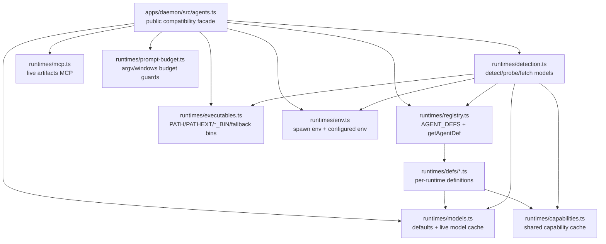

## 概览

### 目标

- 拆分 `agents.ts` 和 `agents.test.ts`。
- 拆分过程中保持 `agents.ts` 名称不变，但使用 `runtimes` 作为新目录名，让 agent 术语后续可以逐步迁移到 runtimes。
- 由于 test coverage 有限，这次 split refactor 主要保持为 code movement，而不是 logic rewriting。如果确实有逻辑必须重写，留到后续处理，以降低整体变更风险。

## 调研

### 现有系统

- `apps/daemon/src/agents.ts` 当前既是 public facade，也是 daemon agent adapters 的 implementation collection。它导出 `AGENT_DEFS`、agent detection、binary resolution、MCP helpers、prompt budget helpers、spawn env helpers 和 model validation helpers。来源：`apps/daemon/src/agents.ts:157,970-983,1094-1111,1132-1433`
- `AGENT_DEFS` 是一个线性 array，目前包含 Claude、Codex、Devin、Gemini、OpenCode、Hermes、Kimi、Cursor Agent、Qwen、Qoder、Copilot、Pi、Kiro、Kilo、Vibe、DeepSeek 等 adapter definitions。来源：`apps/daemon/src/agents.ts:157-812`
- Agent definitions 内联 adapter-specific CLI protocols、model fallbacks、reasoning options、stream formats、fallback binaries、MCP discovery 和 env knobs。来源：`apps/daemon/src/agents.ts:157-260,420-467,549-760,812-899`
- Executable resolution 共享 `AGENT_BIN_ENV_KEYS`、PATH/toolchain directory discovery、configured binary overrides、fallback binaries 和 Windows PATHEXT handling。来源：`apps/daemon/src/agents.ts:91-109,900-983`
- detection flow 复用 executable resolution、agent env、version probing、help capability probing 和 model fetching，并刷新 live model cache。来源：`apps/daemon/src/agents.ts:985-1105,1394-1419`
- MCP live artifacts 当前由 `buildLiveArtifactsMcpServersForAgent` 生成；当 `def.mcpDiscovery === 'mature-acp'` 时，它会创建 `od mcp live-artifacts` server config。来源：`apps/daemon/src/agents.ts:1111-1121`
- Prompt budget helpers 覆盖 argv-bound adapters 的 raw prompt byte budget、Windows `.cmd/.bat` shim command-line budget，以及 Windows direct `.exe` command-line budget。来源：`apps/daemon/src/agents.ts:1123-1330`
- spawn env helper 会 merge configured env、展开 `~`，并以 case-insensitive 方式处理 Claude Code 的 `ANTHROPIC_API_KEY`/`ANTHROPIC_BASE_URL` strategy。来源：`apps/daemon/src/agents.ts:1342-1392`
- `apps/daemon/tests/agents.test.ts` 通过 `../src/agents.js` 导入 facade exports，并集中测试 registry、per-agent args、MCP、executable resolution、env 和 prompt budget。来源：`apps/daemon/tests/agents.test.ts:12-21,134-220,315-379,1060-1369,1812-2109`
- test file 顶部集中维护 agent fixtures、env snapshots、`globalThis.fetch` snapshot、`process.platform` descriptor，以及 `afterEach` restoration。来源：`apps/daemon/tests/agents.test.ts:24-124`
- 其他 daemon modules 直接通过 `./agents.js` / `../src/agents.js` 使用 facade：server 使用 MCP helper 和 spawn env，connection test 使用 spawn env，chat-route test 使用 `getAgentDef`。来源：`apps/daemon/src/server.ts:22-32,5298,5576`；`apps/daemon/src/connectionTest.ts:26-27,1009`；`apps/daemon/tests/chat-route.test.ts:25`
- 仓库 guidance 仍将 CLI/agent argument changes 指向 `apps/daemon/src/agents.ts` 和对应 parser tests；app tests 应保持在 `apps/<app>/tests/` 中。来源：`apps/AGENTS.md:12-24`

### 可选方案

- **Pure migration with facade**：保留 `apps/daemon/src/agents.ts` 作为现有 imports 的 facade，在内部拆分 implementation，并让现有 tests 在第一阶段继续从 `../src/agents.js` 读取。来源：`specs/change/20260509-agents-ts-split/agents-merge-conflict-report.md:160-175,227-249`
- **Domain module split**：将 executable resolver、env、MCP、prompt budget、registry、models 和 per-adapter defs 拆到独立 modules，遵循 report 中列出的 target structure。来源：`specs/change/20260509-agents-ts-split/agents-merge-conflict-report.md:177-206`
- **Test split by responsibility**：将单个 `agents.test.ts` file 拆成 defs、per-adapter args、executables、env、MCP 和 prompt-budget test files，并提取 env restore 与 tmp executable fixture helpers。来源：`specs/change/20260509-agents-ts-split/agents-merge-conflict-report.md:208-266`
- **Registry stabilization**：后续让 `defs/index.ts` 按 sorted agent id 导出，并让 `registry.ts` aggregate array 且强制 id uniqueness。来源：`specs/change/20260509-agents-ts-split/agents-merge-conflict-report.md:268-277`
- **No facade migration**：直接更改 caller imports 可行性有限，因为 `server.ts`、`connectionTest.ts`、`chat-route.test.ts` 和现有 agent tests 都依赖 `agents.js` facade。来源：`apps/daemon/src/server.ts:22-32`；`apps/daemon/src/connectionTest.ts:26-27`；`apps/daemon/tests/chat-route.test.ts:25`；`apps/daemon/tests/agents.test.ts:12-21`

### 约束与依赖

- Zest spec 要求保留 `agents.ts` 名称，使用 `runtimes` 作为新目录名，并在后续逐步将 agents concept 重命名为 runtimes。来源：`specs/change/20260509-agents-ts-split/spec.md:12-14`
- 当前 source 使用 `.js` import specifiers，因此拆出的 TypeScript files 必须保留 ESM import suffix convention。来源：`apps/daemon/src/agents.ts:12-13`；`specs/change/20260509-agents-ts-split/agents-merge-conflict-report.md:292-293`
- `agentCapabilities` 是 module-level cache，`buildArgs` 会读取 detection 期间写入的 capability flags。来源：`apps/daemon/src/agents.ts:29-35,198-217,1043-1061`
- executable resolver 有 module-level `cachedToolchainDirs`/toolchain path behavior；tests 覆盖 OD_AGENT_HOME、NPM_CONFIG_PREFIX、VP_HOME、PATHEXT、fallbackBins 和 configured `*_BIN` overrides。来源：`apps/daemon/src/agents.ts:900-983`；`apps/daemon/tests/agents.test.ts:1060-1361,1858-2004`
- `fetchModels`/`probe` 有有意保留的 fallback behavior：model listing 和 version/help probing failures 会保留 fallback models 或 availability state。来源：`apps/daemon/src/agents.ts:985-1069`
- Test changes 应留在 `apps/daemon/tests/` 中，而 `src/` 保持 source-only。来源：`apps/AGENTS.md:14-24`
- Verification commands 应使用 daemon-scoped checks：`pnpm --filter @open-design/daemon typecheck` 和 `pnpm --filter @open-design/daemon test`。来源：`apps/AGENTS.md:39-46`；`specs/change/20260509-agents-ts-split/agents-merge-conflict-report.md:244-249,262-266`
- report 中列出的主要风险是 module initialization order、circular dependencies、ESM suffixes、test isolation 和 export compatibility。来源：`specs/change/20260509-agents-ts-split/agents-merge-conflict-report.md:278-299`

### 关键引用

- `specs/change/20260509-agents-ts-split/agents-merge-conflict-report.md:10-28` - merge conflict counts 和 registry conflict pattern。
- `specs/change/20260509-agents-ts-split/agents-merge-conflict-report.md:41-80` - executable/env conflict surfaces。
- `specs/change/20260509-agents-ts-split/agents-merge-conflict-report.md:82-123` - MCP、argv/stdin tests、fixture conflict surfaces。
- `specs/change/20260509-agents-ts-split/agents-merge-conflict-report.md:158-277` - proposed staged split。
- `apps/daemon/src/agents.ts:157-1433` - current implementation surface。
- `apps/daemon/tests/agents.test.ts:1-2109` - current concentrated test surface。

## 设计

### 架构概览

### 变更范围

- 区域：`apps/daemon/src/agents.ts` 变成 thin public facade，re-export 现有 API surface，保持当前从 `./agents.js` 和 `../src/agents.js` 的 imports 稳定。影响：本次变更只移动内部文件，不迁移 callers。来源：`apps/daemon/src/server.ts:22-32,5298,5576`；`apps/daemon/src/connectionTest.ts:26-27,1009`；`apps/daemon/tests/chat-route.test.ts:25`；`apps/daemon/tests/agents.test.ts:12-21`
- 区域：新的 `apps/daemon/src/runtimes/` modules 拥有被移动的 implementation。影响：新目录名遵循 spec 的 runtimes naming direction，同时保留旧 facade name。来源：`specs/change/20260509-agents-ts-split/spec.md:12-14`
- 区域：adapter definitions 从 monolithic `AGENT_DEFS` array 移到 `runtimes/defs/` 下的 per-runtime definition files。影响：merge conflicts 缩小到单个 runtime files，同时 registry behavior 仍保持集中。来源：`apps/daemon/src/agents.ts:157-812`；`specs/change/20260509-agents-ts-split/agents-merge-conflict-report.md:10-28,177-206`
- 区域：tests 从单个集中的 `agents.test.ts` 移到 `apps/daemon/tests/runtimes/` 下基于责任拆分的 files 和 shared helpers。影响：test ownership 仍留在 daemon tests，source 仍保持 source-only。来源：`apps/daemon/tests/agents.test.ts:1-2109`；`apps/AGENTS.md:14-24`
- 区域：没有 database、API contract、generated artifact 或 rollout migration surface。影响：validation 是 daemon typecheck 和 daemon tests。来源：`apps/AGENTS.md:39-46`；`specs/change/20260509-agents-ts-split/agents-merge-conflict-report.md:244-266`

### 设计决策

- 决策：保留 `apps/daemon/src/agents.ts` 作为唯一 compatibility facade，并将 implementation 移到 `apps/daemon/src/runtimes/`。来源：`specs/change/20260509-agents-ts-split/spec.md:12-14`；`specs/change/20260509-agents-ts-split/agents-merge-conflict-report.md:160-206`
- 决策：保留 facade 当前的 public export names，包括 registry、detection、executable resolution、MCP、prompt budget、env 和 model helpers。来源：`apps/daemon/src/agents.ts:970-983,1094-1111,1132-1433`；`apps/daemon/tests/agents.test.ts:12-21`
- 决策：phase 1 和 phase 2 保持为 code movement 与 test movement，不做 behavioral rewrites 或 runtime-order changes。来源：`specs/change/20260509-agents-ts-split/spec.md:12-14`；`specs/change/20260509-agents-ts-split/agents-merge-conflict-report.md:160-175,208-266`
- 决策：在 `runtimes/registry.ts` 中集中 `AGENT_DEFS` aggregation，并按现有顺序导入各个 `runtimes/defs/*.ts` definitions。来源：`apps/daemon/src/agents.ts:157-812`；`specs/change/20260509-agents-ts-split/agents-merge-conflict-report.md:268-277`
- 决策：将 singleton mutable state 隔离到专门 helper modules：`capabilities.ts` 拥有 `agentCapabilities`，`executables.ts` 拥有 toolchain directory cache，`models.ts` 拥有 live model cache。来源：`apps/daemon/src/agents.ts:29-35,900-983,1394-1433`
- 决策：强制 dependency direction：facade 到 domain modules、registry 到 defs、detection 到 helpers，helpers 远离 facade/registry，除非明确需要。来源：`specs/change/20260509-agents-ts-split/agents-merge-conflict-report.md:278-299`
- 决策：每个新的 TypeScript import 都保留 ESM `.js` import specifiers。来源：`apps/daemon/src/agents.ts:12-13`；`specs/change/20260509-agents-ts-split/spec.md:43-50`
- 决策：按行为拆分 tests，同时在测试 compatibility 行为时继续通过 `../../src/agents.js` 导入。来源：`apps/daemon/tests/agents.test.ts:12-21`；`apps/daemon/tests/agents.test.ts:134-220,315-379,1060-1369,1812-2109`

### 为什么这样设计

- 它能降低 report 中识别出的 adapter-definition 和 test-responsibility seams 上的 merge conflicts，同时保持 public facade 稳定。
- 它立即遵循 runtimes naming direction，这样后续术语迁移不会从新建 `src/agents/` implementation tree 开始。
- 它通过把 stateful helpers 移动为单一 modules，而不是复制或重写它们，来最小化行为风险。
- 它让 compatibility tests 继续指向 facade，因此缺失 exports 和意外 caller breakage 会尽早失败。

### 测试策略

- Registry and facade：通过 `../../src/agents.js` 验证 exported definitions、ids、lookup behavior 和当前 compatibility imports。来源：`apps/daemon/tests/agents.test.ts:12-21,134-220`
- Adapter args：将 argv/stdin/acp/runtime argument assertions 拆成 focused files，同时保留现有 fixtures。来源：`apps/daemon/tests/agents.test.ts:315-379`；`specs/change/20260509-agents-ts-split/agents-merge-conflict-report.md:208-266`
- Executables：保留 configured `*_BIN`、PATH lookup、fallback binaries、toolchain dirs、OD_AGENT_HOME、NPM_CONFIG_PREFIX、VP_HOME、Windows PATHEXT 和 missing executable cases 的 coverage。来源：`apps/daemon/src/agents.ts:900-983`；`apps/daemon/tests/agents.test.ts:1060-1361,1858-2004`
- Env：保留 configured env merge、`~` expansion，以及 Claude Code API key/base URL 的 case-insensitive handling。来源：`apps/daemon/src/agents.ts:1342-1392`
- Detection and models：保留 probing、help capability flags、fetch model fallback behavior 和 live model cache updates。来源：`apps/daemon/src/agents.ts:985-1105,1394-1419`
- MCP and prompt budget：保留 mature ACP MCP live artifacts behavior 和 argv/Windows command-line budget checks。来源：`apps/daemon/src/agents.ts:1111-1330`
- Validation：每个 implementation step 后运行 `pnpm --filter @open-design/daemon typecheck` 和 `pnpm --filter @open-design/daemon test`。来源：`apps/AGENTS.md:39-46`；`specs/change/20260509-agents-ts-split/agents-merge-conflict-report.md:244-266`

### 伪代码

Flow:
  1. 创建 `runtimes/` helper modules，用于 models、capabilities、invocation、paths、executables、env、MCP、prompt budget、detection、registry 和 definitions。
  2. 将 unchanged code blocks 从 `agents.ts` 移入对应 modules。
  3. 使用 `.js` suffixes 更新 imports，并让 singleton state 只归一个 owning module。
  4. 将 `agents.ts` 内容替换为与此前 public API 匹配的 facade exports。
  5. 将 `agents.test.ts` 拆分为 focused `apps/daemon/tests/runtimes/*.test.ts` files 和 shared helpers。
  6. 运行 daemon typecheck/tests，然后只处理 movement-related failures。

### 文件结构

- `apps/daemon/src/agents.ts` - stable public facade，re-export 现有 daemon runtime helpers。
- `apps/daemon/src/runtimes/types.ts` - 从 monolith 移出的 shared runtime definition 和 helper types。
- `apps/daemon/src/runtimes/models.ts` - default model option、model validation helpers、live model cache。
- `apps/daemon/src/runtimes/capabilities.ts` - detection 与 runtime args 使用的 shared capability cache。
- `apps/daemon/src/runtimes/invocation.ts` - 围绕 `execAgentFile` 的 process invocation wrapper。
- `apps/daemon/src/runtimes/paths.ts` - home expansion 和 path utilities。
- `apps/daemon/src/runtimes/executables.ts` - executable resolution、PATH scanning、PATHEXT、fallback bins、toolchain dirs。
- `apps/daemon/src/runtimes/env.ts` - `spawnEnvForAgent` 和 configured environment handling。
- `apps/daemon/src/runtimes/mcp.ts` - live artifacts MCP server construction。
- `apps/daemon/src/runtimes/prompt-budget.ts` - prompt argv 和 Windows command-line budget checks。
- `apps/daemon/src/runtimes/detection.ts` - runtime detection、probing、help capability discovery、model fetching。
- `apps/daemon/src/runtimes/resolution.ts` - 从 registry 到 executable resolver 的 `resolveAgentBin` glue。
- `apps/daemon/src/runtimes/registry.ts` - `AGENT_DEFS`、`getAgentDef`、id uniqueness guard。
- `apps/daemon/src/runtimes/defs/*.ts` - 从当前 `AGENT_DEFS` array 移出的 per-runtime definitions。
- `apps/daemon/tests/runtimes/*.test.ts` - 按 responsibility 拆分的 daemon runtime tests。
- `apps/daemon/tests/runtimes/helpers/*.ts` - 从当前 monolith 提取的 shared env、fetch、platform、executable fixture helpers。

### Interfaces / APIs

- `apps/daemon/src/agents.ts` 继续导出 daemon callers 和 tests 使用的当前 public API。
- 新的 `runtimes/*` modules 是 internal daemon implementation modules；除非未来 spec 推广 dedicated contract，否则 external app/package imports 应继续通过 `agents.ts`。
- Test helpers 保持在 `apps/daemon/tests/runtimes/helpers/` 下，不被 app source 导入。

### 边界情况

- 初始拆分期间保留当前 `AGENT_DEFS` order，确保 UI order 和现有 assertions 稳定。
- 对 `agentCapabilities`、toolchain dirs 和 live models，移动 caches，不复制 caches。
- 保留 failed version/help/model probing 的 intentional fallback behavior。
- module movement 后继续覆盖 Windows-specific PATHEXT 和 command-line budget paths。
- 在拆分后的 tests 中继续共享 env restoration、`globalThis.fetch` restoration 和 `process.platform` descriptor restoration。

## 计划

- [x] Step 1：建立 runtime module skeleton 和 facade
  - [x] Substep 1.1 Implement：创建 `apps/daemon/src/runtimes/` modules，并在不改变行为的前提下移动 shared types/constants/helpers。
  - [x] Substep 1.2 Implement：用现有 API surface 的 compatibility exports 替换 `apps/daemon/src/agents.ts`。
  - [x] Substep 1.3 Verify：通过 facade 运行 daemon typecheck 和 split runtime tests。
- [x] Step 2：拆分 runtime definitions 和 registry
  - [x] Substep 2.1 Implement：在保留顺序的前提下，将每个 `AGENT_DEFS` entry 移入 `runtimes/defs/*.ts`。
  - [x] Substep 2.2 Implement：在 `runtimes/registry.ts` 中集中 aggregation 和 lookup，并加入 id uniqueness guard。
  - [x] Substep 2.3 Verify：运行 registry、args、detection 和 daemon typecheck coverage。
- [x] Step 3：按责任拆分 tests
  - [x] Substep 3.1 Implement：在 `apps/daemon/tests/runtimes/helpers/` 下提取 shared env/fetch/platform/tmp executable helpers。
  - [x] Substep 3.2 Implement：将 `agents.test.ts` 拆成 registry、args、executables、env、detection、MCP 和 prompt-budget test files。
  - [x] Substep 3.3 Verify：运行 `pnpm --filter @open-design/daemon test`，并确保 split tests 在相关场景中仍通过 facade 导入 compatibility APIs。
- [x] Step 4：稳定 edge cases 并审查边界
  - [x] Substep 4.1 Implement：修复 validation 发现的 movement-only circular imports、`.js` import suffixes 和 singleton ownership issues。
  - [x] Substep 4.2 Verify：运行 `pnpm --filter @open-design/daemon typecheck` 和 `pnpm --filter @open-design/daemon test`。
  - [x] Substep 4.3 Verify：按 app test placement 与 facade compatibility boundaries 审查 changed files。

## 备注

<!-- Optional sections — add what's relevant. -->

### 实现

- 将 `apps/daemon/src/agents.ts` 拆成指向 `apps/daemon/src/runtimes/*` modules 的 thin facade。
- 将 adapter definitions 移到 `apps/daemon/src/runtimes/defs/*.ts`，并在 `apps/daemon/src/runtimes/registry.ts` 中保留 registry order。
- 在专门 modules 中保持 singleton ownership：capabilities cache、executable toolchain-dir cache 和 live model cache。
- 将 daemon agent tests 拆分到 `apps/daemon/tests/runtimes/*.test.ts`，shared helpers 放在 `apps/daemon/tests/runtimes/helpers/`。
- review 后修复 configured-env `~` expansion，并为 home-path expansion 添加 split-test coverage。

### 验证

- `pnpm --filter @open-design/daemon typecheck` ✅
- `pnpm --filter @open-design/daemon exec vitest run -c vitest.config.ts tests/runtimes` ✅
- `pnpm --filter @open-design/daemon exec vitest run -c vitest.config.ts tests/chat-route.test.ts` ✅，此前 `tests/chat-route.test.ts` 有一次 full-suite flaky failure。
- `pnpm --filter @open-design/daemon test` ⚠️ runtime split tests passed；full suite 仍在既有无关 `tests/finalize-design.test.ts` assertions 失败，原因是 resolved artifact names 包含 long relative temp paths。
