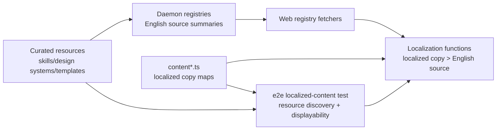

## 概览

### 问题陈述

- `content.ts`、`content.fr.ts` 和 `content.ru.ts` 为 localized resource display 维护了大批手写 English fallback ID arrays。
- Runtime localization 在 localized copy 缺失时已经使用 English resource fields，因此这些 arrays 主要是为了满足 coverage tests。
- 多个添加 skills、design systems 或 prompt templates 的 PR 会编辑同一批 fallback arrays，导致很大的 merge conflicts。
- 将 fallback declarations 移入 `SKILL.md` frontmatter，会把这类 bookkeeping 负担转嫁给 asset authors，并让 skill contributions 更难。

### 目标

- 让 English fallback 成为每个 locale 的 resource display 默认 runtime behavior。
- 从 `content.ts`、`content.fr.ts` 和 `content.ru.ts` 中移除 `*_IDS_WITH_EN_FALLBACK` arrays。
- 让 localized copy maps 成为唯一手写 resource localization data。
- 保留现有 display behavior：localized copy 优先，English source data 填充任何缺失 copy。
- 将 resource coverage 限定在 `de`、`fr` 和 `ru`，也就是当前带 resource display copy dictionaries 的 locales。
- 保留 coverage，证明每个被发现的 curated resource 都具备用于 fallback display 的 English source fields。

### 范围

- 更新 web localized ID construction，使其跟踪 localized copy dictionaries 与 category/tag dictionaries，而不使用 fallback arrays。
- 移除手工维护的 fallback arrays 及其 imports/exports。
- 更新 localized coverage tests，从被发现的 resource source data 验证默认 fallback semantics。
- 不修改 `SKILL.md`、`DESIGN.md` 和 prompt-template JSON asset metadata。

### 约束

- 不提交 generated registry file。
- 避免把 merge conflicts 从 centralized content files 转移到 asset metadata。
- 除非 runtime API payloads 确实变化，否则保持 `packages/contracts` 不变。
- 保持 resource-localized locale scope 显式：当前 localized resource content 存在于 `de`、`fr` 和 `ru`。

### 成功标准

- 添加新的 English-only skill、design system 或 prompt template 时，不需要为 display fields 编辑 per-resource fallback ID list 或 per-resource localized copy；category/tag taxonomy localization 仍遵循现有 coverage。
- 并发 asset PR 不需要触碰 fallback arrays。
- Localized display 仍在有 translated copy 时显示翻译，在缺失时显示 English resource fields。
- 当被发现的 curated resource 缺少 fallback display 所需的 English source fields 时，coverage 会失败。

## 调研

### 现有系统

- Supported UI locales 包含许多语言，但 resource display localization 只通过 `LOCALIZED_CONTENT_IDS` 为 `de`、`ru` 和 `fr` 接线。Source: `apps/web/src/i18n/types.ts:1-5`; `apps/web/src/i18n/content.ts:1114-1174`
- Web i18n display content 目前存储 localized copy maps，并为每个 resource-localized locale 存储三组 fallback ID arrays。Source: `apps/web/src/i18n/content.ts:40-49,367-439,542-551`; `apps/web/src/i18n/content.fr.ts:320-393,493-502`; `apps/web/src/i18n/content.ru.ts:320-393,493-502`
- `LOCALIZED_CONTENT` 将 `de`、`ru` 和 `fr` 连接到 copy maps 与 fallback arrays；`buildLocalizedContentIds` 会把 copy keys 与 fallback IDs 合并用于 coverage。Source: `apps/web/src/i18n/content.ts:1114-1174`
- Runtime localization 在 localized resource copy 缺失时已经 fallback 到 English source fields。Source: `apps/web/src/i18n/content.ts:1188-1232`
- Localized coverage 是一个 e2e Vitest test，它导入 `LOCALIZED_CONTENT_IDS`，从 resource directories 中发现 skills、design systems 和 prompt templates，并期望每个被发现的 resource ID 都出现在 localized IDs 中。Source: `e2e/tests/localized-content.test.ts:26-37,53-60,154-174`
- Skill IDs 通过扫描 `skills/*/SKILL.md` 发现；测试在存在时读取 frontmatter `name`，否则 fallback 到 directory name。Source: `e2e/tests/localized-content.test.ts:62-89,133-151`
- Design system IDs 从 `design-systems/*/DESIGN.md` 发现；categories 从 `> Category:` blockquote line 解析。Source: `e2e/tests/localized-content.test.ts:91-104`
- Prompt template IDs、categories 和 tags 从 `prompt-templates/{image,video}/*.json` 发现。Source: `e2e/tests/localized-content.test.ts:107-130`
- Daemon resource registries 已暴露 runtime fallback 使用的 source English fields；web registry fetchers 消费这些 daemon endpoints。Source: `apps/daemon/src/skills.ts:94-171`; `apps/daemon/src/design-systems.ts:23-48`; `apps/daemon/src/prompt-templates.ts:36-70`; `apps/web/src/providers/registry.ts:86-94,170-198`
- Git history 显示 fallback arrays 是在 resource imports 和 locale additions 后作为 coverage 机制增长起来的：`abaae96e` 为 57 个 imported systems 添加 design-system coverage，`f12471f2` 泛化 fallback arrays，`10e8e2d3` 为 Russian 复制这一模式，`c881c0ca` 为 French 复制这一模式。Source: `git log -S 'WITH_EN_FALLBACK' -- apps/web/src/i18n/content.ts apps/web/src/i18n/content.fr.ts apps/web/src/i18n/content.ru.ts`

### 可用方案

- **Option A: 默认 English fallback + e2e displayability checks**。移除手工 resource fallback IDs，保留 localized copy maps，并让 coverage 根据被发现的 source resources 和现有 runtime fallback behavior 推导 displayability。Source: `apps/web/src/i18n/content.ts:1188-1232`; `e2e/tests/localized-content.test.ts:62-130,154-174`
- **Option B: 保留 centralized fallback arrays**。当前实现按 locale 和 asset family 在 `content.ts`、`content.fr.ts` 和 `content.ru.ts` 中存储显式 fallback arrays。Source: `apps/web/src/i18n/content.ts:367-439,542-551`; `apps/web/src/i18n/content.fr.ts:320-393,493-502`; `apps/web/src/i18n/content.ru.ts:320-393,493-502`
- **Option C: asset 自声明 fallback metadata**。Asset scanners 可以从 owner files 读取 `i18n.fallbackToEnglish`，但这会给每个 English-only asset contribution 增加必要的 i18n bookkeeping。Source: `apps/daemon/src/skills.ts:94-171`; `apps/daemon/src/design-systems.ts:23-48`; `apps/daemon/src/prompt-templates.ts:36-70`
- **Option D: 生成供 web 消费的 fallback registry**。仓库已有 artifact manifests 的 generated-artifact pattern，但 i18n coverage test 目前直接从 source content 和 on-disk assets 计算 coverage。Source: `apps/web/src/artifacts/manifest.ts:68-93,96-145`; `apps/web/tests/artifacts/manifest.test.ts:10-57,107-120`; `e2e/tests/localized-content.test.ts:154-174`

### 约束与依赖

- `packages/contracts` 是 shared web/daemon app contract layer，并且必须保持 pure TypeScript；API payload shapes 变化时，web/daemon DTO changes 才属于那里。Source: `packages/AGENTS.md:5-13`; `packages/contracts/src/api/registry.ts:25-83`
- App tests 位于 package/app-level `tests/` 下；cross-app/resource consistency checks 属于 `e2e/tests/`。Source: `AGENTS.md:54-60`; `apps/AGENTS.md:27-32`; `e2e/AGENTS.md:19-38`
- Web source code 从 daemon/runtime summaries 接收 resource lists，而 e2e 可直接扫描 repository directories 做 cross-resource coverage。Source: `apps/web/src/providers/registry.ts:86-94,170-198`; `e2e/tests/localized-content.test.ts:62-130`
- 当前部分代码在缺少 resource directories 或 asset files malformed 时，会返回 empty lists 或 skip entries。此 coverage 的 E2E discovery 应在 missing roots、malformed JSON/frontmatter、missing IDs 和 missing required English display fields 时 fail fast。Source: `apps/daemon/src/skills.ts:94-110`; `apps/daemon/src/design-systems.ts:23-51`; `apps/daemon/src/prompt-templates.ts:36-59`; `e2e/tests/localized-content.test.ts:53-60`
- Coverage 目前验证 localized copy keys 与 fallback arrays 的 union，因此移除 fallback arrays 需要更新围绕 `LOCALIZED_CONTENT_IDS` 的 test contract。Source: `apps/web/src/i18n/content.ts:1150-1174`; `e2e/tests/localized-content.test.ts:154-174`

### 关键参考

- `apps/web/src/i18n/content.ts:40-49,367-439,542-551,1114-1174` - central localized content bundle、German fallback arrays、localized ID construction。
- `apps/web/src/i18n/content.fr.ts:320-393,493-502` - French fallback arrays。
- `apps/web/src/i18n/content.ru.ts:320-393,493-502` - Russian fallback arrays。
- `apps/web/src/i18n/content.ts:1188-1232` - runtime localization functions 和现有 English fallback behavior。
- `e2e/tests/localized-content.test.ts:26-37,53-60,62-130,154-174` - coverage test 与 resource discovery logic。
- `apps/web/src/i18n/types.ts:1-5` - 完整 UI locale set。
- `apps/web/src/providers/registry.ts:86-94,170-198` - runtime resource summaries 从 daemon APIs 流入 web。

## 设计

### 架构概览



推荐架构：默认 English fallback、web-owned resource-localization semantics，以及 e2e-owned cross-resource coverage。

### 变更范围

- Area: asset metadata。Impact: 保持 `SKILL.md`、`DESIGN.md` 和 prompt-template JSON 不变；不添加 `i18n.fallbackToEnglish` declarations。Source: `skills/dcf-valuation/SKILL.md:1-26`; `design-systems/wechat/DESIGN.md:1-5`; `prompt-templates/image/social-media-post-showa-day-retro-culture-magazine-cover.json:1-22`
- Area: contracts and daemon APIs。Impact: fallback 不需要 API DTO changes；现有 English summaries 仍是 fallback source。Source: `packages/contracts/src/api/registry.ts:25-83`; `apps/daemon/src/static-resource-routes.ts:46-68,148-176`; `apps/web/src/providers/registry.ts:86-94,170-198`
- Area: web i18n。Impact: 移除 hand-authored fallback arrays，并保留 localized copy/category/tag maps；runtime localization 保持 localized-copy-first English fallback。Source: `apps/web/src/i18n/content.ts:40-49,1114-1174,1188-1232`; `apps/web/src/i18n/content.fr.ts:320-393,493-502`; `apps/web/src/i18n/content.ru.ts:320-393,493-502`
- Area: localized ID semantics。Impact: 让 `LOCALIZED_CONTENT_IDS` 专注于 localized copy/category/tag dictionaries；将 all-resource displayability coverage 移至 e2e discovery。Source: `apps/web/src/i18n/content.ts:1150-1174`; `e2e/tests/localized-content.test.ts:154-174`
- Area: coverage。Impact: 更新 `e2e/tests/localized-content.test.ts` 以发现 resources，在 malformed resource sources 上 fail fast，并断言每个 resource 都有 required English fallback fields；保留 `de`、`fr` 和 `ru` 的 category/tag coverage。Source: `e2e/tests/localized-content.test.ts:53-60,62-130,154-197`; `e2e/AGENTS.md:19-38`

### 设计决策

- Decision: English fallback 对每个 locale 都是 implicit runtime behavior；resource-localized dictionaries 的 coverage 仍限定在 `de`、`fr` 和 `ru`。Source: `apps/web/src/i18n/content.ts:1188-1232`; `apps/web/src/i18n/content.ts:1114-1174`; `e2e/tests/localized-content.test.ts:62-130,154-174`
- Decision: `de`、`fr` 和 `ru` 仍是显式 resource-localized locale set，因为只有这些 locales 有 resource display copy modules。Source: `apps/web/src/i18n/content.ts:1114-1174`; `apps/web/src/i18n/types.ts:1-5`
- Decision: `SKILL.md` frontmatter 和其他 asset metadata 继续聚焦 asset behavior，而不是 fallback bookkeeping。Source: `apps/daemon/src/skills.ts:29-34,94-171`; `skills/dcf-valuation/SKILL.md:1-26`
- Decision: 让 web i18n 继续拥有 fallback semantics，因为 localized copy maps 和 runtime display functions 都在那里。Source: `apps/web/src/i18n/content.ts:40-49,1114-1174,1188-1232`
- Decision: 将 cross-resource coverage 保留在 e2e，因为它横跨 apps/web i18n source 和顶层 resource directories。Source: `AGENTS.md:54-60`; `e2e/AGENTS.md:19-38`; `e2e/tests/localized-content.test.ts:26-37,62-130`
- Decision: 避免 generated fallback registries；e2e discovery 与 runtime daemon summaries 已在各自环境中提供 resource lists。Source: `e2e/tests/localized-content.test.ts:62-130`; `apps/web/src/providers/registry.ts:86-94,170-198`

### 为什么这样设计

- 它移除了 merge conflict hotspots，而不会给每个 asset contribution 增加 i18n chores。
- 它匹配当前 runtime behavior：localized copy 覆盖 English source data，缺失 localized copy 时显示 English。
- 它让 locale semantics 继续集中在 web i18n。
- 它保留 displayability coverage，同时把缺失翻译转化为 translation debt，而不是阻塞贡献者的 metadata。

### 测试策略

- Web i18n: 为 exported localized IDs 添加或更新 tests，证明 fallback arrays 已移除，并且 localized copy/category/tag dictionaries 仍驱动 localized metadata coverage。Source: `apps/AGENTS.md:27-32`; `apps/web/src/i18n/content.ts:1150-1174`
- E2E: 更新 `e2e/tests/localized-content.test.ts`，让 source resource displayability 从 discovered resources 与默认 English fallback 推导。Required fields: skill description、design-system summary/category fallback input、prompt-template title and summary；skill `examplePrompt` 仍为 optional。Source: `e2e/tests/localized-content.test.ts:62-130,154-197`; `e2e/AGENTS.md:19-38`
- E2E: 保留针对 localized dictionaries 的 category 和 prompt tag coverage，因为 category/tag strings 不来自单一 resource summary fallback path。Source: `e2e/tests/localized-content.test.ts:176-197`
- Validation commands: 针对 changed packages 运行 package-scoped checks，并运行 repo-level guard/typecheck。Source: `AGENTS.md:87-108`; `apps/AGENTS.md:47-59`; `packages/AGENTS.md:22-36`; `e2e/AGENTS.md:40-55`

### Pseudocode

```ts
const RESOURCE_LOCALIZED_LOCALES = ['de', 'fr', 'ru'] as const;

function buildLocalizedContentIds(content) {
  return {
    skills: Object.keys(content.skillCopy),
    designSystems: Object.keys(content.designSystemSummaries),
    promptTemplates: Object.keys(content.promptTemplateCopy),
    designSystemCategories: Object.keys(content.designSystemCategories),
    promptTemplateCategories: Object.keys(content.promptTemplateCategories),
    promptTemplateTags: Object.keys(content.promptTemplateTags),
  };
}

function expectResourceDisplayable(locale, resource) {
  const localized = localizeResource(locale, resource);
  expect(requiredDisplayFields(localized)).toBeNonEmpty();
}

// Required English fallback fields:
// - skills: description; examplePrompt is optional
// - design systems: summary or category
// - prompt templates: title and summary

function discoverResourcesOrThrow() {
  // Fail on missing resource roots, malformed JSON/frontmatter,
  // missing IDs, and missing required English fallback fields.
}
```

### 文件结构

- `apps/web/src/i18n/content.ts` - 移除手工维护的 fallback arrays，并保持 localized-copy-first runtime fallback behavior。
- `apps/web/src/i18n/content.fr.ts` - 移除 exported French fallback ID arrays。
- `apps/web/src/i18n/content.ru.ts` - 移除 exported Russian fallback ID arrays。
- `apps/web/tests/i18n/content.test.ts` 或现有 i18n tests - localized ID 与 fallback behavior coverage。
- `e2e/tests/localized-content.test.ts` - default fallback displayability coverage。

### Interfaces / APIs

```ts
type ResourceLocalizedLocale = Extract<Locale, 'de' | 'fr' | 'ru'>;

type LocalizedContentIds = {
  skills: string[];
  designSystems: string[];
  designSystemCategories: string[];
  promptTemplates: string[];
  promptTemplateCategories: string[];
  promptTemplateTags: string[];
};
```

### 边界情况

- Resource 出现在 localized copy map 中，但已从 discovered resources 缺失：将其保留在 localized IDs 中，并在有用时让 coverage/reporting 暴露 stale copy。
- Resource 只有部分 localized copy，例如只有 `examplePrompt`：localized field 按字段优先，English 补全缺失字段。
- 新 locale 只有 UI dictionary：runtime resource display 使用 English fallback；当该 locale 获得 resource copy dictionaries 时，才开始 category/tag resource-localization coverage。
- Category/tag localization 仍基于 dictionary；missing category/tag entries 应继续在 coverage 中可见，因为 gallery 无法从 resource summaries 推断 translated labels。
- Derived skill IDs 遵循现有 discovery behavior 和 runtime source summaries；不需要 fallback metadata inheritance。

## 计划

- [x] Step 1: 从 web i18n 中移除 manual fallback arrays
  - [x] Substep 1.1 Implement: 从 `apps/web/src/i18n/content.ts` 的 `LocalizedContentBundle` 中移除 fallback array fields。
  - [x] Substep 1.2 Implement: 移除 `DE_*_IDS_WITH_EN_FALLBACK`、`FR_*_IDS_WITH_EN_FALLBACK` 和 `RU_*_IDS_WITH_EN_FALLBACK` definitions/imports/exports。
  - [x] Substep 1.3 Implement: 在 `localizeSkill*`、`localizeDesignSystemSummary` 和 `localizePromptTemplateSummary` 中保留 localized-copy-first English fallback。
  - [x] Substep 1.4 Verify: 为 localized copy precedence 和 English field fallback 添加或更新 web i18n tests。
- [x] Step 2: 更新 localized resource coverage semantics
  - [x] Substep 2.1 Implement: 更新 `e2e/tests/localized-content.test.ts`，以 fail-fast parsing 发现 skills、design systems 和 prompt templates。
  - [x] Substep 2.2 Implement: 断言 required English fallback fields 存在：skill description、design-system summary/category fallback input、prompt-template title and summary。
  - [x] Substep 2.3 Implement: 对 `de`、`fr` 和 `ru` 保留 category 和 tag coverage against localized dictionaries。
  - [x] Substep 2.4 Implement: 添加清晰 assertion messages，区分 missing English fallback fields 和 missing category/tag translations。
  - [x] Substep 2.5 Verify: 运行 localized-content e2e test file。
- [x] Step 3: 清理 docs 并验证
  - [x] Substep 3.1 Implement: 移除描述 fallback arrays 为 required bookkeeping 的 comments。
  - [x] Substep 3.2 Verify: 运行受影响 web/e2e typechecks 和 tests。
  - [x] Substep 3.3 Verify: 运行 `pnpm guard` 和 `pnpm typecheck`。

## 备注

### 实现

- `apps/web/src/i18n/content.ts` - 移除 fallback ID fields 和 arrays；`LOCALIZED_CONTENT_IDS` 现在只从 localized copy/category/tag dictionaries 派生 IDs。
- `apps/web/src/i18n/content.fr.ts` - 移除 French exported fallback ID arrays。
- `apps/web/src/i18n/content.ru.ts` - 移除 Russian exported fallback ID arrays。
- `apps/web/tests/i18n/content.test.ts` - 添加 localized precedence、English fallback 和 localized ID derivation 的 runtime coverage。
- `e2e/tests/localized-content.test.ts` - 将 resource displayability coverage 移到 discovered English resource fields，添加 fail-fast resource parsing，并为 `de`、`fr` 和 `ru` 保留 localized category/tag coverage。

### 验证

- `pnpm --filter @open-design/web exec vitest run -c vitest.config.ts tests/i18n/content.test.ts` - 通过。
- `pnpm typecheck` from `e2e/` - 通过。
- `pnpm test tests/localized-content.test.ts` from `e2e/` - 通过。
- Reviewer subagent - 修复后没有 blocking issues。
- `pnpm guard` - 通过。
- `pnpm typecheck` - 通过。
