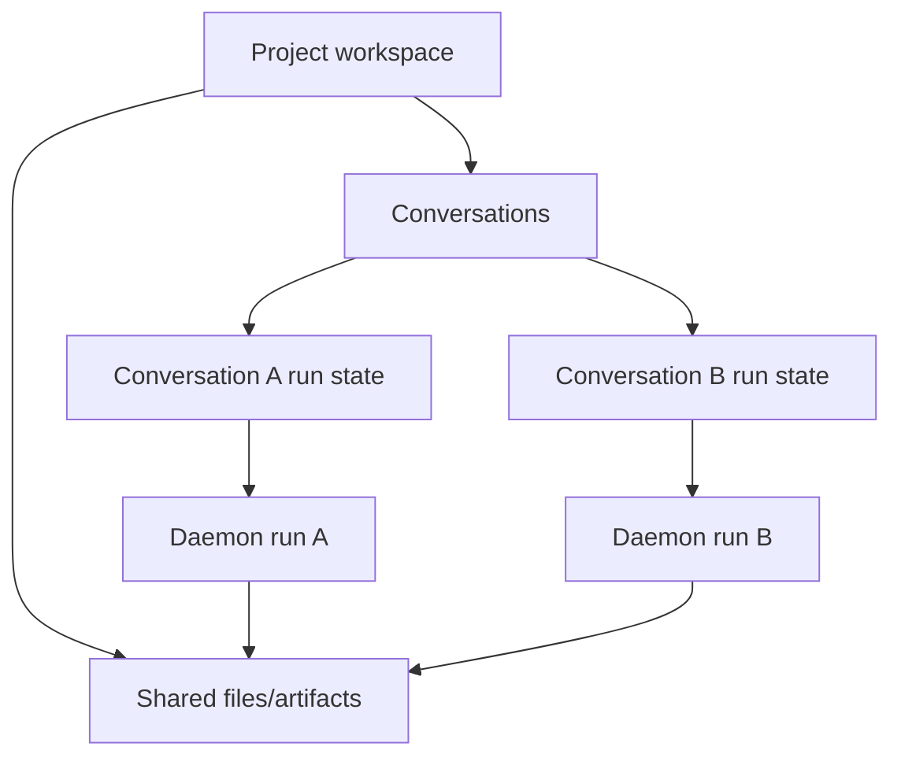

## 概览

Issue #138 报告：同一 project 中，一个 conversation 的 unfinished task 会阻塞另一个 conversation 发送消息。相关 issue #148 描述的是同一个底层 run-state isolation bug：running/failed/elapsed state 泄漏到其他 conversations。

目标：让 chat run UI state 按 conversation 作用域隔离，同时保持 project workspace 共享。

约束：
- 不为这个 fix 引入 project-level writer lock 或 run scheduler。
- 允许同一 project 中多个 conversations 并发运行。
- 真实 file-write conflicts 继续通过现有 agent/tool path 可见地失败。
- 保持 daemon run cancellation 显式：切换 conversations 应 detach local SSE listeners，而不是 cancel background runs。

开放问题：
- 未来 UX 是否应显示 project-wide “another conversation is modifying files” hint。
- 未来 persistence 是否应保证 long-running background transcript recovery，超出当前 daemon event buffer behavior。

## 调研

### 现有系统

- `ProjectView` 目前把 chat busy state 存为一个 project-level `streaming` boolean。Source: `apps/web/src/components/ProjectView.tsx:263`
- `handleSend` 在 `streaming` 为 true 时会阻止所有发送，不管 active conversation 是哪个。Source: `apps/web/src/components/ProjectView.tsx:1073-1082`
- `ChatComposer` 使用同一个 `streaming` prop 来禁止 submit，并把 send button 切成 Stop mode。Source: `apps/web/src/components/ChatComposer.tsx:599-627,910-929`
- Conversation switches 会 abort browser-side SSE listeners，并让 daemon runs 保持 alive；cleanup 有意避免 abort cancel signals。Source: `apps/web/src/components/ProjectView.tsx:428-453`
- Reattach 已按 `projectId` 和 `conversationId` 查询 active runs。Source: `apps/web/src/components/ProjectView.tsx:864-899`, `apps/web/src/providers/daemon.ts:204-210`
- Daemon run service 在每个 run 上存储 `projectId`、`conversationId` 和 `assistantMessageId`。Source: `apps/daemon/src/runs.ts:15-24`
- Daemon run list 支持按 project、conversation 和 active status 过滤。Source: `apps/daemon/src/runs.ts:117-123`, `apps/daemon/src/chat-routes.ts:65-70`
- Run creation 不强制 project-wide mutex。Source: `apps/daemon/src/chat-routes.ts:46-63`

### 可用方案

- **Conversation-scoped UI busy state**：按 conversation 跟踪 active run/listener state，并从 `activeConversationId` 派生当前 composer state。Source: `apps/web/src/components/ProjectView.tsx:256-263,1073-1082`
- **Project-level scheduler/lock**：按 project 序列化 runs，这与 #138 的需求冲突；#138 要求一个 fresh conversation 可在另一个 conversation 未完成时发送。Source: issue #138 discussion and `apps/daemon/src/chat-routes.ts:46-63`
- **Daemon API rewrite**：primary fix 不需要这样做，因为 run identity 和 filters 已包含 `conversationId`。Source: `apps/daemon/src/runs.ts:15-24,117-123`

### 约束与依赖

- Project files 和 live artifacts 仍是 project-scoped shared resources，因此并发 conversations 可能产生交错 file events。Source: `apps/web/src/components/ProjectView.tsx:552-617,1173-1226`
- Stop handling 目前会 cancel 当前 `messages` array 中可见的所有 active assistant messages，并使用 shared cancel refs；它必须变成 current-conversation scoped。Source: `apps/web/src/components/ProjectView.tsx:1640-1674`
- Completion notification logic 依赖 `streaming` true-to-false edge；当 busy state 改为 conversation-scoped 后，需要对应调整。Source: `apps/web/src/components/ProjectView.tsx:469-523`

### 关键参考

- GitHub issue #138 - user-facing send block symptom。
- GitHub issue #148 - duplicate state-leak regression case。

## 设计

### 架构概览

### 变更范围

- Area: `ProjectView` run lifecycle。Impact: 用 current-conversation busy derivation 替换 project-wide chat busy assumptions。Source: `apps/web/src/components/ProjectView.tsx:263,1073-1082`
- Area: `ChatPane` / `ChatComposer` props。Impact: composer 应收到 active conversation 是否 busy，而不是任何 project run 是否 busy。Source: `apps/web/src/components/ProjectView.tsx:2129-2152`, `apps/web/src/components/ChatComposer.tsx:599-627,910-929`
- Area: run reattach and stop behavior。Impact: reattach 和 cancellation 只应应用到 active conversation 的 run。Source: `apps/web/src/components/ProjectView.tsx:864-899,1640-1674`
- Area: daemon tests。Impact: 添加/保留 conversation-filtered active run listing 的 regression coverage。Source: `apps/daemon/src/runs.ts:117-123`

### 设计决策

- Decision: 在 web UI 中以 conversation granularity 跟踪 chat run busy state，并从 `activeConversationId` 派生 `currentConversationBusy`。Source: `apps/web/src/components/ProjectView.tsx:256-263,1073-1082`
- Decision: 保持 project files/artifacts 为 project-scoped，并允许 concurrent writes 通过现有 tool/file path 失败。Source: `apps/web/src/components/ProjectView.tsx:552-617,1173-1226`
- Decision: 本 fix 不添加 daemon-level project serialization，因为 daemon runs 已可按 conversation 识别，且 creation 不阻塞。Source: `apps/daemon/src/runs.ts:15-24`, `apps/daemon/src/chat-routes.ts:46-63`
- Decision: Conversation switching 应 detach browser SSE listeners，同时保留 daemon background runs。Source: `apps/web/src/components/ProjectView.tsx:428-453`
- Decision: Stop 应只针对当前 conversation 的 active run/controller。Source: `apps/web/src/components/ProjectView.tsx:1640-1674`

### 为什么这样设计

- 它直接修复 state boundary mismatch：conversation 拥有 messaging/run UI state，project 拥有 shared files。
- 它让实现保持小而可观察。
- 它保留真实 concurrent file conflicts 的 fail-fast behavior，而不是用 queues 或 optimistic merges 隐藏。

### 测试策略

主要验证应使用 unit/component tests。E2E 可稍后补，因为可靠创建 long-running agent run 需要 deterministic test agent 或 fixture。

#### Web component/unit tests

添加聚焦 regression file，例如 `apps/web/tests/components/ProjectView.run-isolation.test.tsx`。

- Test #138 send-lock regression:
  - Arrange project `p1`，包含 conversations `conv-a` 和 `conv-b`。
  - 加载 `conv-a` messages，其中有一个 `runStatus` 为 `running`、`runId` 为 `run-a` 的 assistant message。
  - 切换到 `conv-b`，或创建/选择没有 active run 的 `conv-b`。
  - 在 composer 中输入并点击 Send。
  - Assert `conv-b` 的 composer 显示 Send mode，且发送不会被 `conv-a` 阻塞。
  - Assert daemon run creation body 包含 `conversationId: 'conv-b'`。
  - Source: `apps/web/src/components/ProjectView.tsx:1073-1082,1353-1362,2129-2152`

- Test #148 state-leak regression:
  - Arrange `conv-a`，带 `runStatus: 'running'` 或 `runStatus: 'failed'`，并带 elapsed/error state。
  - 切换到 messages 中没有 active assistant run 的 `conv-b`。
  - Assert `conv-b` 不渲染 `conv-a` 的 running/failed/elapsed state。
  - Assert composer 处于 Send mode，且最后一个 `conv-b` assistant message 不被当作 streaming。
  - Source: `apps/web/src/components/ChatPane.tsx:304-307`, `apps/web/src/components/ProjectView.tsx:2129-2152`

- Test conversation switch preserves background run:
  - Arrange `conv-a`，包含 active `run-a` 和一个 mounted SSE listener。
  - 切换到 `conv-b`。
  - Assert browser-side listener cleanup 会运行，但不会调用 `/api/runs/run-a/cancel`。
  - 切回 `conv-a`。
  - Assert reattach 会查询 `projectId: 'p1'` 和 `conversationId: 'conv-a'` 的 active runs。
  - Source: `apps/web/src/components/ProjectView.tsx:428-453,864-899`, `apps/web/src/providers/daemon.ts:204-210`

- Test Stop scope:
  - Arrange `conv-a` 和 `conv-b` 各自都有 active run state。
  - 让 `conv-b` active 并点击 Stop。
  - Assert 只调用 `/api/runs/<run-b>/cancel`。
  - Assert `conv-a` 仍保持 active，且不会被当前 view 标记为 canceled。
  - Source: `apps/web/src/components/ProjectView.tsx:1640-1674`

#### Daemon unit test

添加到 `apps/daemon/tests/runs.test.ts`：

- 在同一 project 中创建两个 active runs，`conversationId` 分别是 `conv-a` 和 `conv-b`。
- 调用 `runs.list({ projectId: 'p1', conversationId: 'conv-b', status: 'active' })`。
- Assert 只返回 `conv-b` run。
- Source: `apps/daemon/src/runs.ts:117-123`

#### 验证命令

- `pnpm --filter @open-design/web test`
- `pnpm --filter @open-design/daemon test`
- `pnpm typecheck`

### Pseudocode

Flow:
  On send:
    if activeConversationId is missing, return
    if currentConversationBusy, return
    create user + assistant message in active conversation
    start daemon run with active conversationId
    mark activeConversationId busy with run/controller metadata

  On conversation switch:
    detach current browser SSE listener
    keep daemon run alive
    load selected conversation messages
    derive composer busy from selected conversation state/messages
    reattach selected conversation active run when present

  On stop:
    find current activeConversationId run/controller
    abort its cancel signal
    mark only current conversation messages canceled

### 文件结构

- `apps/web/src/components/ProjectView.tsx` - conversation-scoped run state、send gate、stop、reattach、notification edge adjustments。
- `apps/web/src/components/ChatPane.tsx` - 将 active-conversation busy state 传给 composer 和 message streaming render。
- `apps/web/src/components/ChatComposer.tsx` - 语义不变，通过现有 `streaming` prop 或重命名 prop 接收 scoped busy prop。
- `apps/web/tests/components/*` - #138/#148 behavior 的 regression coverage。
- `apps/daemon/tests/runs.test.ts` - daemon run filtering regression。

## 计划

- [x] Step 1: 添加 regression coverage
  - [x] Substep 1.1 Verify: reproduce blocked send when another conversation has an active run。
  - [x] Substep 1.2 Verify: cover conversation-filtered active run listing in daemon service。
- [x] Step 2: 将 web run UI state 限定到 active conversation
  - [x] Substep 2.1 Implement: 从 active conversation load/run state 派生 busy state。
  - [x] Substep 2.2 Implement: 在 conversation switches 上清理 stale message/render state。
  - [x] Substep 2.3 Implement: 当 target conversation messages 仍在 loading 时阻塞 sends。
  - [x] Substep 2.4 Verify: 防止 fresh conversation loading 时重复创建 empty conversation。
- [x] Step 3: 验证实现
  - [x] Substep 3.1 Verify: 运行 focused ProjectView regression tests。
  - [x] Substep 3.2 Verify: 运行 focused daemon run service test。
  - [x] Substep 3.3 Verify: 运行 guard 和 typecheck。

## 备注

<!-- Optional sections — add what's relevant. -->

### 实现

- `apps/web/src/components/ProjectView.tsx` - 添加 active-conversation message ownership state、loading-aware busy derivation、send gating 和 synchronous conversation-switch cleanup。
- `apps/web/tests/components/ProjectView.run-isolation.test.tsx` - 添加 regression tests，覆盖在不同 conversation 发送、loading-window send blocking，以及 fresh-conversation duplicate prevention。
- `apps/daemon/tests/runs.test.ts` - 添加 service-level regression coverage，覆盖同一 project 内按 conversation 过滤 active run。

### 验证

- 已确认新的 web regression 在修复前失败：切换到 `conv-b` 后，`expected 'streaming' to be 'idle'`。
- `pnpm --filter @open-design/web exec vitest run -c vitest.config.ts tests/components/ProjectView.run-isolation.test.tsx tests/components/ProjectView.run-cleanup.test.tsx tests/components/ProjectView.pendingPrompt.test.tsx` - 通过。
- `pnpm --filter @open-design/daemon exec vitest run -c vitest.config.ts tests/runs.test.ts` - 通过。
- `pnpm --filter @open-design/web typecheck` - 通过。
- `pnpm guard` - 通过。
- `pnpm typecheck` - 通过。
- Reviewer subagent final pass: no remaining blocking issues。
