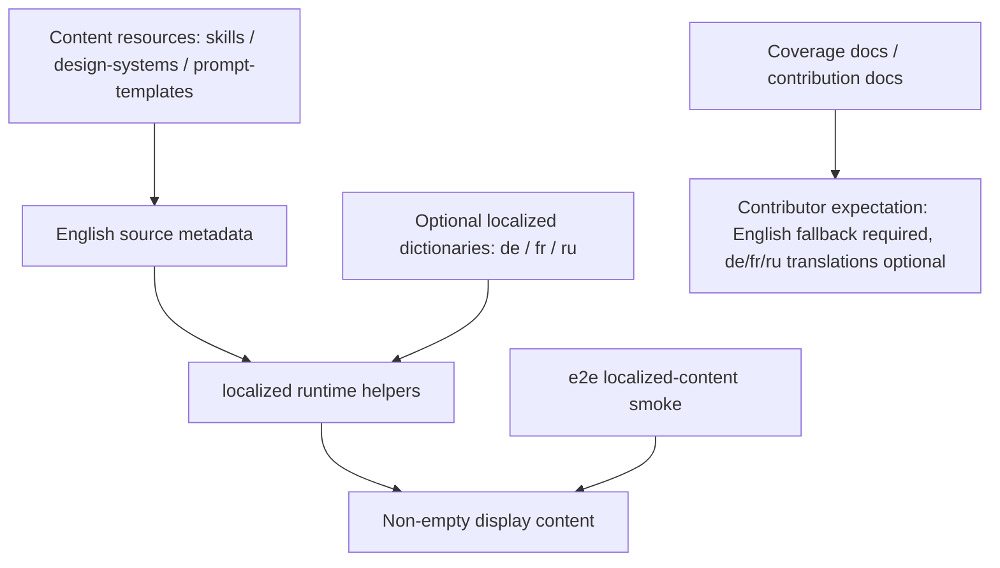

## 概览

### 问题陈述

- `apps/web/src/i18n` 下的内容翻译包含 `de`、`fr` 和 `ru`，但当前翻译覆盖并不完整。
- 这些面向内容的 i18n 翻译需要变成可选项，这样内容贡献者就不必补齐每个相关语言条目。

### 目标

- 降低内容类贡献的门槛。
- 减少后续补完多语言内容时发生冲突的概率。

### 范围

- 调整 `apps/web/src/i18n` 下内容类翻译的要求，让 `de`、`fr`、`ru` 等未完成翻译成为可选项。

### 成功标准

- 内容贡献者可以提交主要内容变更，而不必同时补完 `de`、`fr`、`ru` 的所有内容类 i18n 翻译。
- 未完成的 `de`、`fr`、`ru` 内容翻译不会阻塞相关贡献流程。

## 调研

### 现有系统

- `apps/web/src/i18n/content.ts` 聚合 `de`、`ru` 和 `fr` 三个内容 bundle，然后从每个 bundle 的 dictionary keys 构建 `LOCALIZED_CONTENT_IDS`。来源：`apps/web/src/i18n/content.ts:954-996`
- 当前 content ids 覆盖六组资源：skills、designSystems、designSystemCategories、promptTemplates、promptTemplateCategories 和 promptTemplateTags。来源：`apps/web/src/i18n/content.ts:26-33,981-989`
- runtime 已经有 English fallback：缺少翻译时，skill description / prompt、design-system summary、design-system category、prompt-template category / tags，以及 prompt-template title / summary 会回退到源内容或原始 tag。来源：`apps/web/src/i18n/content.ts:1010-1053`
- Web unit tests 确认 localized ids 只来自 localized dictionaries，并确认缺少 localized copy 时字段会回退到 English source content 或原始 tag。来源：`apps/web/tests/i18n/content.test.ts:12-19,21-80`
- E2E localized-content test 会读取真实仓库资源中的 skills、design systems 和 prompt templates，然后遍历 `de`、`fr`、`ru` 验证 display content。来源：`e2e/tests/localized-content.test.ts:333-377`

### 当前强制翻译触发条件

- 新增一个全新的 Design System category 会触发强制补全：测试从 `design-systems/*/DESIGN.md` 的 `> Category:` 中提取 categories，并要求每个 locale 的 `ids.designSystemCategories` 包含所有发现的 category。来源：`e2e/tests/localized-content.test.ts:194-240,390,398-401`
- 新增一个全新的 Prompt Template category 会触发强制补全：测试从 `prompt-templates/image/*.json` 和 `prompt-templates/video/*.json` 读取 `category`，缺失时默认成 `General`，并要求每个 locale 的 `ids.promptTemplateCategories` 覆盖所有发现的 category。来源：`e2e/tests/localized-content.test.ts:243-330,391-405`
- 新增一个全新的 Prompt Template tag 会触发强制补全：测试读取 prompt template 的 `tags` arrays，并要求每个 locale 的 `ids.promptTemplateTags` 覆盖所有发现的 tag。来源：`e2e/tests/localized-content.test.ts:313-318,394-409`
- Featured Skill / Design Template 的 locale-specific display copy 要求来自贡献文档：设置 `od.featured: 1` 时，文档要求在 `content.ts`、`content.fr.ts` 和 `content.ru.ts` 中提供完整 localized display copy。来源：`docs/skills-contributing.md:197-202`

### 非强制或已经有 fallback 的路径

- 添加普通 skill 或 design template 时，E2E test 只要求资源可显示；non-featured 路径使用 `SKILL.md` 中的 English display fields 作为 fallback。来源：`docs/skills-contributing.md:188-195`；`e2e/tests/localized-content.test.ts:155-191,351-357`
- 添加 design system summary 时，文档说明只有已经存在翻译时才更新 localized summary dictionary，默认会自动应用 English fallback。来源：`docs/design-systems.md:251-273`
- 添加 prompt template title / summary 时，E2E test 只要求 localized result 非空；runtime 中缺失 localized prompt-template copy 时，会回退到 English `title` 和 `summary`。来源：`e2e/tests/localized-content.test.ts:366-375`；`apps/web/src/i18n/content.ts:1045-1051`
- Scenario tag UI labels 使用来自 `SCENARIO_LABEL_KEY` 的固定 i18n keys；未知 tags 会从原始 tag 做 title-case。来源：`apps/web/src/components/ExamplesTab.tsx:51-70,423-431`

### 可选方案

- 调整 E2E category/tag coverage assertions，让 `de`、`fr` 和 `ru` content dictionaries 对 design-system categories、prompt-template categories 和 prompt-template tags 变为可选，并依赖现有 runtime fallback。来源：`e2e/tests/localized-content.test.ts:380-409`；`apps/web/src/i18n/content.ts:1031-1052`
- 保留资源可显示的 smoke coverage：继续验证 skills、design systems 和 prompt templates 在 `de`、`fr`、`ru` 下会产生非空 display content。来源：`e2e/tests/localized-content.test.ts:333-377`
- 更新贡献文档，将 featured localized copy 从必需改成可选或推荐，并明确说明 English fallback path。来源：`docs/skills-contributing.md:188-202`
- 更新 localized-content 的 coverage docs，让它描述“displayable + fallback”，而不是“每个 locale 覆盖每个 id / category / tag”。来源：`docs/testing/e2e-coverage/settings.md:68-69,121`

### 约束与依赖

- `LOCALIZED_CONTENT_IDS` 目前直接由 localized dictionary keys 生成；任何仍用这些 ids 做完整 array-containing coverage 的测试都会让缺失翻译成为阻塞项。来源：`apps/web/src/i18n/content.ts:981-996`；`e2e/tests/localized-content.test.ts:398-409`
- 缺少 prompt template category 时，测试资源读取器会将其归类为 `General`；没有 category 的新增 templates 仍会进入 `General` coverage set。来源：`e2e/tests/localized-content.test.ts:311-312`
- Prompt template tags 会过滤掉非字符串和空字符串值，因此强制 coverage 只适用于有效的非空 tags。来源：`e2e/tests/localized-content.test.ts:313-318`
- 贡献文档当前把 featured localized copy 标为必需路径；实现变更也必须更新这些文档，否则内容贡献者仍会被文档要求补齐翻译。来源：`docs/skills-contributing.md:197-202,232-241`

### 关键引用

- `apps/web/src/i18n/content.ts:954-1053` - localized bundles、content ids 和 runtime fallback。
- `e2e/tests/localized-content.test.ts:333-409` - localized display coverage 和 mandatory category/tag coverage assertions。
- `apps/web/tests/i18n/content.test.ts:12-80` - localized ids 和 fallback unit tests。
- `docs/skills-contributing.md:188-202,232-241` - skill / design-template i18n contribution requirements。
- `docs/design-systems.md:251-273` - design-system localized summary fallback docs。
- `docs/testing/e2e-coverage/settings.md:68-69,121` - 描述 localized-content 的 e2e coverage docs。

## 设计

### 架构概览

### 变更范围

- 区域：`e2e/tests/localized-content.test.ts` 中的 category / tag coverage assertions。影响：移除 `de` / `fr` / `ru` dictionaries 必须覆盖每个发现的 design-system category、prompt-template category 和 prompt-template tag 的硬性要求，同时保留 resource display smoke test。来源：`e2e/tests/localized-content.test.ts:333-409`
- 区域：`apps/web/src/i18n/content.ts` 中的 runtime fallback。影响：这是可选翻译的 runtime 基础；不需要新增 fallback 机制。来源：`apps/web/src/i18n/content.ts:1010-1053`
- 区域：`apps/web/tests/i18n/content.test.ts` 中的 fallback unit tests。影响：加强或保留字段级 fallback assertions，确保缺少 localized copy 时 English source fields 仍会生效。来源：`apps/web/tests/i18n/content.test.ts:21-80`
- 区域：`docs/skills-contributing.md` 和 `docs/testing/e2e-coverage/settings.md`。影响：更新 contributor requirements 和 coverage descriptions，说明“English fallback required, localized copy optional”。来源：`docs/skills-contributing.md:188-202,232-241`；`docs/testing/e2e-coverage/settings.md:68-69,121`
- 区域：`docs/design-systems.md`。影响：保持现有 design-system fallback docs 语义一致，只有需要同步时才调整措辞。来源：`docs/design-systems.md:251-273`

### 设计决策

- 决策：不改变 `LOCALIZED_CONTENT_IDS` 的生成方式；它继续表达“当前这个 locale 已有翻译的 ids 集合”。来源：`apps/web/src/i18n/content.ts:981-996`；`apps/web/tests/i18n/content.test.ts:12-19`
- 决策：删除或改写 E2E 中名为 `covers every discovered design-system category and prompt tag` 的 full coverage assertion，让 category / tag dictionary keys 变成可选翻译列表。来源：`e2e/tests/localized-content.test.ts:380-409`；`apps/web/src/i18n/content.ts:1031-1052`
- 决策：保留 E2E smoke test `derives displayable resources from discovered English fallback content`，因此 skills、design systems 和 prompt templates 在 `de` / `fr` / `ru` 下仍必须产生可显示的非空内容。来源：`e2e/tests/localized-content.test.ts:333-377`
- 决策：在资源读取阶段保留 fail-fast English fallback validation，例如缺失 `description`、design-system `category` 或 prompt-template `title` / `summary`。来源：`e2e/tests/localized-content.test.ts:155-179,194-240,243-330`
- 决策：修改文档，让 featured localized copy 成为推荐增强路径，而 contribution PRs 的必需路径聚焦于完整 English display copy 和 fallback coverage。来源：`docs/skills-contributing.md:188-202,232-241`
- 决策：将 coverage matrix 中的 SET-043 / SET-044 改写为 fallback display integrity 和 optional translation validation，使文档不再表达 full locale / full id coverage。来源：`docs/testing/e2e-coverage/settings.md:68-69,121`

### 为什么这样设计

- runtime 已经具备字段级 fallback，因此这次变更主要是把 tests 和 docs 从“translation completeness gate”转向“display integrity gate”。
- `LOCALIZED_CONTENT_IDS` 保持现有含义，因此后续仍可用于展示 translation coverage 或检查既有 translation dictionaries。
- 资源仍必须提供完整 English metadata，真正必需的 fallback inputs 缺失时继续提前失败。

### 测试策略

- E2E：运行 `pnpm --filter @open-design/e2e test tests/localized-content.test.ts`，验证真实仓库资源在 `de` / `fr` / `ru` 下仍可显示，并且缺少 category / tag 翻译不会阻塞。来源：`e2e/tests/localized-content.test.ts:333-377`；`e2e/AGENTS.md:40-55`
- Web unit：运行 `pnpm --filter @open-design/web test`，覆盖 localized ids 仍来自 dictionaries，以及 skill/design-system/prompt-template 的字段级 fallback。来源：`apps/web/tests/i18n/content.test.ts:12-80`；`apps/AGENTS.md:27-33,47-59`
- Probe：临时添加一个没有匹配 `de` / `fr` / `ru` localized dictionary entries 的 probe content resource，然后运行 CI-equivalent verification，确认 English fallback 可显示且缺失可选翻译不会阻塞；随后移除临时 probe content。来源：`e2e/tests/localized-content.test.ts:155-409`；`docs/skills-contributing.md:188-202`
- Repo checks：运行 `pnpm guard` 和 `pnpm typecheck`，覆盖仓库级 scripts 与类型边界。来源：`AGENTS.md#validation-strategy`

### 伪代码

Flow:
  1. 读取真实资源，并验证必需的 English fallback metadata fields。
  2. 为 `de` / `fr` / `ru` 调用 runtime localization helper。
  3. 断言 skill description、design-system summary 和 prompt-template title / summary 非空。
  4. 缺少 localized dictionary entries 时，让 design-system category、prompt-template category 和 prompt-template tag 使用 original-value fallback。
  5. 在文档中说明 localized dictionaries 是可选增强，而贡献仍要求 English fallback metadata。

### 文件结构

- `e2e/tests/localized-content.test.ts` - 调整 category / tag coverage tests，并保留 real-resource fallback smoke test。
- `apps/web/tests/i18n/content.test.ts` - 保留或加强 fallback unit tests。
- `docs/skills-contributing.md` - 更新 skill / design-template contribution i18n requirements。
- `docs/testing/e2e-coverage/settings.md` - 更新 localized-content coverage matrix descriptions。
- `docs/design-systems.md` - 如有需要则同步措辞，确保 design-system fallback docs 保持一致。

### Interfaces / APIs

- 不涉及 external API、DTO、database schema 或 sidecar protocol 变更。
- `LOCALIZED_CONTENT_IDS` export 保持不变，继续表示现有 localized dictionaries 的 key set。来源：`apps/web/src/i18n/content.ts:981-1000`

### 边界情况

- 没有 `category` 的 prompt template 会继续被归类为 `General`；如果 `General` 没有 localized copy，则回退到原始值。来源：`e2e/tests/localized-content.test.ts:311-312`；`apps/web/src/i18n/content.ts:1035-1052`
- Prompt template tags 只适用于有效的非空字符串；缺少 localized tag 时会回退到原始 tag。来源：`e2e/tests/localized-content.test.ts:313-318`；`apps/web/src/i18n/content.ts:1045-1052`
- 没有 localized copy 的 featured skill 会显示 English fallback，文档将 localized copy 定位为推荐增强路径。来源：`docs/skills-contributing.md:188-202`
- 缺少 English fallback metadata 会继续失败，避免空 display content 掩盖资源错误。来源：`e2e/tests/localized-content.test.ts:155-179,194-240,243-330`

## 计划

- [x] Step 1：调整 localized-content test gate
  - [x] Substep 1.1 Implement：移除或改写把 `LOCALIZED_CONTENT_IDS` 与发现的 categories / tags 对比的 full coverage assertions。
  - [x] Substep 1.2 Implement：保留真实资源在 `de` / `fr` / `ru` 下显示非空内容的 fallback smoke test。
  - [x] Substep 1.3 Implement：需要时添加直接 category / tag fallback assertions，覆盖缺少 dictionary entries 时返回原始值的行为。
  - [x] Substep 1.4 Verify：运行 `pnpm --filter @open-design/e2e test tests/localized-content.test.ts`。
- [x] Step 2：同步贡献和 coverage 文档
  - [x] Substep 2.1 Implement：更新 `docs/skills-contributing.md`，将 featured localized copy 描述为可选增强路径。
  - [x] Substep 2.2 Implement：更新 `docs/testing/e2e-coverage/settings.md` 中的 SET-043 / SET-044 coverage descriptions。
  - [x] Substep 2.3 Implement：检查 `docs/design-systems.md` 是否与新语义一致，只在需要时做轻量措辞调整。
  - [x] Substep 2.4 Verify：手动确认文档不再把 `de` / `fr` / `ru` 内容翻译描述为内容贡献的硬性阻塞要求。
- [x] Step 3：回归验证
  - [x] Substep 3.1 Verify：运行 `pnpm --filter @open-design/web test`。
  - [x] Substep 3.2 Verify：临时添加一个没有 `de` / `fr` / `ru` localized dictionary entries 的 probe content resource，运行 CI-equivalent verification，确认通过后移除 probe content。
  - [x] Substep 3.3 Verify：运行 `pnpm guard`。
  - [x] Substep 3.4 Verify：运行 `pnpm typecheck`。

## 备注

### 实现

- `e2e/tests/localized-content.test.ts` - 移除了把发现的 category / tag values 与 `LOCALIZED_CONTENT_IDS` 对比的 full coverage gate，保留 real-resource displayability smoke test，并添加直接 assertions，确认缺少 dictionary entries 时 design-system category 以及 prompt-template category / tag values 会回退到 source values。
- `apps/web/tests/i18n/content.test.ts` - 加强了 prompt-template category 未知时 fallback 行为的 unit assertion。
- `docs/skills-contributing.md` - 将 featured skills 的 localized display copy 改为可选增强路径，并明确 tests 聚焦于 displayable resources 和 fallback behavior。
- `docs/testing/e2e-coverage/settings.md` - 将 SET-043 / SET-044 改写为 fallback display integrity 和 optional translation behavior coverage。
- `docs/design-systems.md` - 现有措辞已经描述了 English fallback 和 optional localized summaries，因此无需变更。

### 验证

- `pnpm --filter @open-design/web test tests/i18n/content.test.ts` - passed。
- `pnpm --filter @open-design/e2e test tests/localized-content.test.ts` - 起初发现并清理了一个已存在的 probe 空目录，随后 passed。
- 临时添加 English-only skill、design template、design system 和 prompt template probes，然后运行 `pnpm --filter @open-design/e2e test tests/localized-content.test.ts` - passed；之后移除了临时 probe content。
- `pnpm --filter @open-design/e2e test tests/localized-content.test.ts` - final passed。
- `pnpm --filter @open-design/web test` - passed，110 files / 1013 tests。
- `pnpm guard` - passed。
- `pnpm typecheck` - passed。
