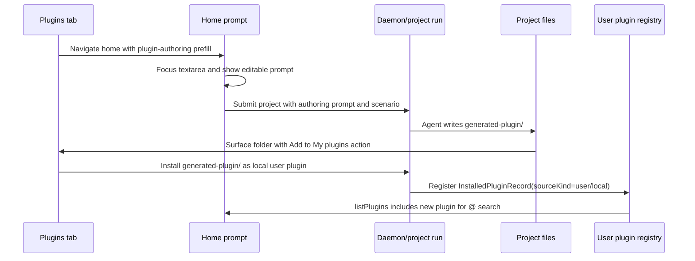

# Plugin authoring flow plan

**Parent:** [`spec.md`](../../docs/spec.md) · **Related:** [`plugin-driven-flow-plan.md`](plugin-driven-flow-plan.md) · [`plugins-implementation.md`](../../docs/plans/plugins-implementation.md)

## 目的

让“create my own plugin”成为一等 product flow，而不是一个脱节的未来 tab。用户应能从 Plugins area 开始，进入已准备好 authoring query 的 Home prompt，运行一个 agent task 来产出 Open Design plugin folder，把该 folder 作为 project output 检查，并一键加入 `My plugins`。

本 plan 有意聚焦 authoring loop。Marketplace publishing、enterprise private catalogs 和 team review policies 不在范围内。

## 需求

- R1. Plugins tab 暴露一个 create entry，启动 guided plugin authoring task，而不是只提供 import options。
- R2. Create entry 导航到 Home，聚焦 `HomeHero` 的 textarea，并预填基于 Open Design plugin spec 的 prompt。
- R3. Task 应创建真实 plugin folder，至少包含 `SKILL.md` 和 `open-design.json`；当用户请求时可包含 optional examples/assets。
- R4. Project output 必须支持选择或查看 generated plugin folder 作为 folder，而不仅是扁平 single files。
- R5. Generated plugin folder 可安装到 user plugin registry，然后出现在 `My plugins` 和 Home `@` search 中。
- R6. Home intent rail 之后可添加 “Create plugin” chip，并复用同一 authoring route 和 prompt contract。

## 范围边界

- 本轮不做 marketplace publishing。安装到 `My plugins` 就足够。
- 本轮不做 enterprise/team catalog permissions。
- 不新增 plugin spec dialect。Generated folder 必须按 `docs/plugins-spec.md` 和 `docs/schemas/open-design.plugin.v1.json` 中现有 Open Design plugin shape 验证。
- 不要求构建完整 visual plugin IDE。第一版是 agent-guided task 加一键 install action。

### 延后到后续工作

- Home rail “Create plugin” chip 可在并行 task 中实现，只要它调用这里定义的同一个 Home prefill/focus contract。
- Marketplace publishing 和 team review workflows 应等 local authoring 与 `My plugins` install 可靠后再做。

## 当前代码上下文

- `apps/web/src/components/PluginsView.tsx` 已拥有 Plugins tab、`Create / Import` button、import modal、`My plugins` tab 和 refresh-after-install behavior。
- `apps/web/src/components/HomeView.tsx` 拥有 prompt state、plugin apply lifecycle，以及通过 `inputRef` 实现的 `HomeHero` focus。
- `apps/web/src/components/HomeHero.tsx` 渲染 textarea、`@` picker 和 intent rail。
- `apps/web/src/components/home-hero/chips.ts` 定义当前 rail chips。未来 declarative `create-plugin` chip 适合放在这里。
- `apps/web/src/components/EntryShell.tsx` 拥有 view switching，以及通过 `pendingPrompt` 和 `autoSendFirstMessage` 创建 project 的 Home submit path。
- `apps/web/src/state/projects.ts` 已暴露 `installPluginSource`、`uploadPluginFolder` 和 `uploadPluginZip`，用于 user plugin installation。
- `apps/daemon/src/server.ts` 已暴露 `/api/plugins/install`、`/api/plugins/upload-folder`、`/api/plugins/upload-zip` 和 `/api/applied-plugins/export`。
- `apps/daemon/src/plugins/scaffold.ts`、`apps/daemon/src/plugins/export.ts` 和 `apps/daemon/src/plugins/validate.ts` 已编码 scaffold/export/validate behavior，authoring flow 应复用这些能力。

## 关键决策

- Product entry 是 “Create plugin”，而不仅是 “Create from template”。Template scaffolding 可以是实现细节之一，但用户意图是描述 workflow，并让 agent 产出 plugin。
- 首个支持入口应是 Plugins tab → Home prompt prefill。这样能在 Home rail 增加另一个 chip 前，先形成可工作的 authoring loop。
- 如果可能，使用专用 bundled scenario plugin 做 authoring，例如 `od-plugin-authoring`。只有作为 interim bridge 时，才接受 fallback 到 `od-new-generation` 加长 prompt。
- Generated plugin folder 应位于 project work directory 内，使其可被 inspect、edit 和 install，而不强制 browser folder upload。
- 一键 “Add to My plugins” 应通过 daemon-visible project output path，沿用 `/api/plugins/install` 使用的同一本地 install path 安装，然后刷新 web plugin state。

## 高层流程

> 这说明预期方法，并作为 review 的方向性 guidance，不是 implementation specification。



## 建议实现单元

- [x] U1. **Home prefill and focus contract**

  **Goal:** 添加一种可复用方式，用于导航到 Home、预填 prompt 并聚焦 textarea。

  **Files:**
  - Modify: `apps/web/src/router.ts`
  - Modify: `apps/web/src/components/EntryShell.tsx`
  - Modify: `apps/web/src/components/HomeView.tsx`
  - Test: `apps/web/tests/router-marketplace.test.ts`
  - Test: `apps/web/tests/components/HomeHero.plugin-picker.test.tsx` or a new `apps/web/tests/components/HomeView.prefill.test.tsx`

  **Approach:**
  - 优先使用小型 route/session handoff，而不是 global singleton state。Handoff 应携带 `{ prompt, focus: true, source: 'plugin-authoring' }`。
  - `HomeView` 应只消费一次 handoff，设置 `prompt`，并调用现有 textarea ref focus path。
  - Submit 前保持 prompt 可由用户编辑。

  **Test scenarios:**
  - Happy path：从 Plugins 带 authoring handoff 导航时，会渲染 Home、填入 textarea 并聚焦。
  - Edge case：handoff 后刷新 Home，不会反复覆盖用户已编辑 prompt。
  - Integration：提交预填 prompt 仍通过现有 `PluginLoopSubmit` path 创建 project。

- [x] U2. **Plugins create entry**

  **Goal:** 将 Plugins tab 的 `Create / Import` surface 拆成两个清晰 action：guided create 和 import。

  **Files:**
  - Modify: `apps/web/src/components/PluginsView.tsx`
  - Modify: `apps/web/src/styles/home/plugins-view.css`
  - Test: `apps/web/tests/components/PluginsView.test.tsx`

  **Approach:**
  - 将 GitHub/zip/folder import 保留在现有 modal 中。
  - 添加 primary `Create plugin` action，使用 U1 导航到 Home，并带上 spec-grounded authoring prompt。
  - 只有当 “Create from template” 启动同一 authoring path，或明确标记为 coming soon 时，才保留在 import modal 中。

  **Test scenarios:**
  - Happy path：点击 `Create plugin` 会用预期 prefill payload 触发 Home navigation。
  - Regression：GitHub/zip/folder import 仍会安装并落到 `My plugins`。
  - Accessibility：create action 有清晰 button label，不伪装成 disabled tab。

- [x] U3. **Plugin authoring scenario**

  **Goal:** 给 agent 一个 purpose-built plugin authoring context，要求正确 files 和 validation behavior。

  **Files:**
  - Create: `plugins/_official/scenarios/od-plugin-authoring/open-design.json`
  - Create: `plugins/_official/scenarios/od-plugin-authoring/SKILL.md`
  - Modify: `apps/web/src/components/home-hero/chips.ts` only when the Home rail chip lands
  - Test: `apps/daemon/tests/plugins-bundled-scenarios-roster.test.ts`
  - Test: `apps/daemon/tests/plugins-local-skill.test.ts`

  **Approach:**
  - Scenario 应指示 agent 输出一个 folder，例如 `generated-plugin/`，其中包含 `SKILL.md`、`open-design.json`，以及 optional `examples/` 或 `assets/`。
  - Prompt 应引用 Open Design plugin spec，并要求 validation-ready output，而不是只有 prose explanation。
  - 如果 scenario 包含 GenUI，它应展示 checklist/progress 和最终 “Add to My plugins” affordance；但 install action 本身应调用 daemon API，而不是依赖 copy/paste。

  **Test scenarios:**
  - Happy path：bundled scenario 出现在 plugin list 中并可被 apply。
  - Integration：应用 scenario 会将其本地 `SKILL.md` body 注入 run snapshot。
  - Regression：常规 `od-new-generation` 与 migration scenarios 不受影响。

- [x] U4. **Generated folder visibility in project output**

  **Goal:** 让用户能从 project workspace 检查并选择 generated plugin folder。

  **Files:**
  - Modify: `apps/web/src/components/DesignFilesPanel.tsx`
  - Modify: `apps/web/src/components/FileWorkspace.tsx`
  - Modify: `apps/web/src/components/FileOpsSummary.tsx` if folder outputs are surfaced from tool/file ops
  - Modify: daemon project file listing endpoints in `apps/daemon/src/server.ts` if they currently flatten directories too aggressively
  - Test: `apps/web/tests/components/FileWorkspace.test.tsx`
  - Test: daemon project file listing tests near the existing project/file tests

  **Approach:**
  - 保留 relative paths，让 `generated-plugin/open-design.json` 和 `generated-plugin/SKILL.md` 保持可见分组。
  - 最小 v1 可以在 `DesignFilesPanel` 中展示 folder row，并展开到其 files；不需要完整 IDE tree。
  - 只有当 folder row 包含 plugin marker file 时，才暴露 install action。

  **Test scenarios:**
  - Happy path：带有 `generated-plugin/open-design.json` 和 `generated-plugin/SKILL.md` 的 project 会渲染 folder group。
  - Edge case：nested files 仍可选择，且不会丢失 relative path。
  - Error path：malformed 或 partial plugin folders 不会显示误导性的 install success action。

- [x] U5. **Install generated folder as My plugin**

  **Goal:** 添加一键 action，将 daemon-visible generated folder 安装到 user plugin registry。

  **Files:**
  - Modify: `apps/web/src/state/projects.ts`
  - Modify: `apps/web/src/components/DesignFilesPanel.tsx` or the GenUI surface that owns the final action
  - Modify: `apps/daemon/src/server.ts`
  - Reuse: `apps/daemon/src/plugins/installer.ts`
  - Reuse: `apps/daemon/src/plugins/validate.ts`
  - Test: `apps/web/tests/state/projects.test.ts`
  - Test: `apps/web/tests/components/FileWorkspace.test.tsx`
  - Test: `apps/daemon/tests/plugins-installer.test.ts`
  - Test: `apps/daemon/tests/plugins-validate.test.ts`

  **Approach:**
  - 添加 web helper，例如 `installGeneratedPluginFolder(projectId, relativePath)`，而不是强制 browser upload。
  - Daemon endpoint 应在 project work directory 下解析 folder，验证 traversal safety，验证 plugin shape，通过现有 installer 安装，并返回与 `PluginInstallOutcome` 兼容的 response。
  - 成功后，web 应刷新 `listPlugins()`，切换/打开 `My plugins`，并让 plugin 可被 Home `@` search 搜到。

  **Test scenarios:**
  - Happy path：project output folder 安装并显示为 user/local plugin。
  - Error path：invalid folder 返回 diagnostics，且不修改 installed plugins。
  - Security：拒绝 `../` traversal 或 project root 外的 absolute paths。
  - Integration：install 后，`GET /api/plugins` 包含新的 record，且 source kind 非 `bundled`。

- [x] U6. **Home rail create-plugin chip parity**

  **Goal:** 让未来 Home rail entry 复用同一 authoring flow，避免重复行为。

  **Files:**
  - Modify: `apps/web/src/components/home-hero/chips.ts`
  - Modify: `apps/web/src/components/HomeView.tsx`
  - Modify: `apps/web/src/components/HomeHero.tsx`
  - Test: `apps/web/tests/components/HomeHero.rail.test.tsx`

  **Approach:**
  - 添加一个 `create-plugin` chip action，调用 U1 prefill/focus contract。
  - 如果它在单独 task session 中落地，payload shape 仍应保持相同，让 Plugins tab 和 rail 入口可以互换。

  **Test scenarios:**
  - Happy path：点击 chip 会填入与 Plugins tab create 相同的 prompt。
  - Regression：现有 Prototype/Image/Figma/Folder/Template chips 继续分发当前 actions。

## Prompt contract

Authoring prompt 应足够稳定，便于测试和建立用户信任。第一版可以是：

```text
Create an Open Design plugin for: <user goal>.

Follow docs/plugins-spec.md and produce a folder named generated-plugin with:
- SKILL.md describing the agent behavior and workflow
- open-design.json with valid metadata, mode, task kind, inputs, and any pipeline/context references
- optional examples/ and assets/ when useful

When finished, summarize the files created and whether the folder is ready to add to My plugins.
```

Implementation 可以用当前 locale 和 UI-provided goal 丰富它，但 required output folder 与 marker files 应保持稳定。

## 风险

- **Generated output is prose-only:** 使用 dedicated authoring scenario 和 prompt contract，明确要求产出 files。
- **Folder paths become unsafe:** 只相对 project root 解析 generated-folder installs；拒绝 traversal 和 absolute external paths。
- **Validation errors feel like failure:** 在 UI 中返回 validation diagnostics，让用户可以要求 agent 修复 plugin，而不是重头开始。
- **Duplicate plugins:** Installer 应使用现有 plugin id/version collision behavior，并在 overwrite 或 upgrade 前展示清晰 messages。
- **Two entrypoints diverge:** Plugins tab 和 Home rail 必须共享同一 prefill payload 和 prompt contract。

## 验证计划

- Web component coverage：覆盖 Plugins create entry、Home prefill/focus 和 rail parity。
- Web state coverage：覆盖安装 generated project folder。
- Daemon tests：覆盖 project-root path resolution、validation failure 和 successful install。
- Authoring scenario 落地后跑 end-to-end smoke path：Plugins → Create plugin → Home submit → project produces `generated-plugin/` → Add to My plugins → Home `@` search finds the new plugin。

## 开放问题

- Generated plugin folder 默认应为 `generated-plugin/` 还是 `<plugin-id>/`？本 plan 假设使用 `generated-plugin/` 便于 UI detection，最终 install 使用 manifest id。
- “Add to My plugins” 应放在 `DesignFilesPanel`、GenUI final surface，还是两处都放？本 plan 允许两者，但 v1 应选一个 primary owner。
- Daemon 现在是否应暴露 scaffold API，还是让 authoring scenario 直接要求 agent 创建 files？直接创建 files 对 v1 更简单；scaffold API 对 template-first creation 会更有用。
