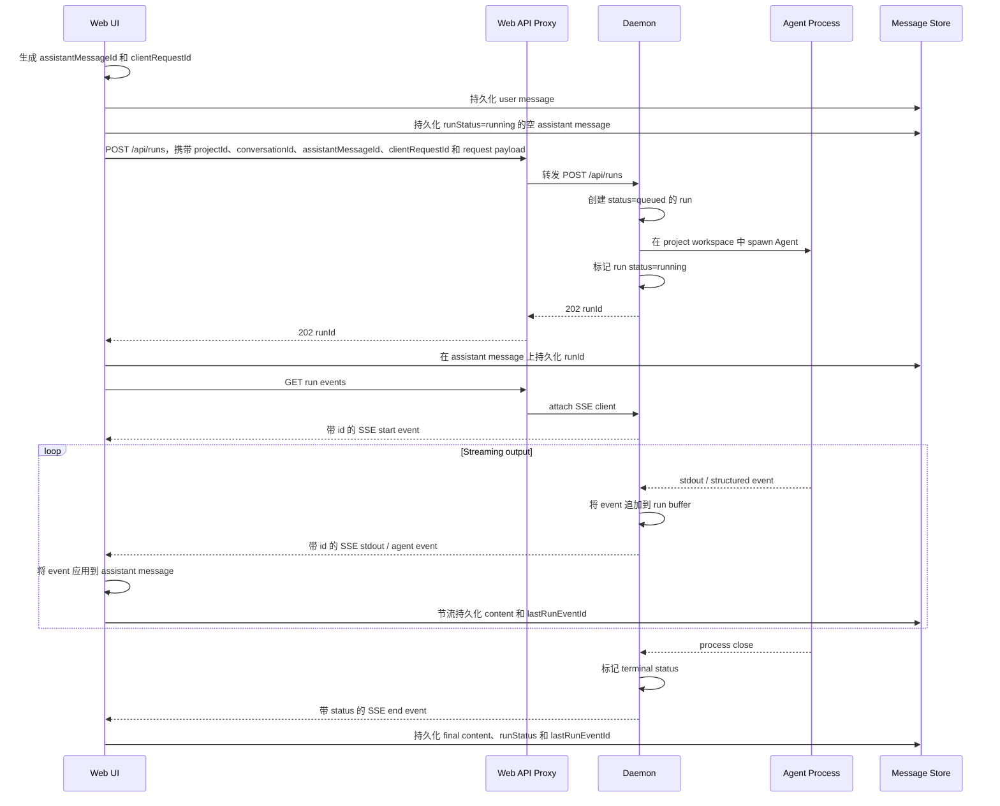
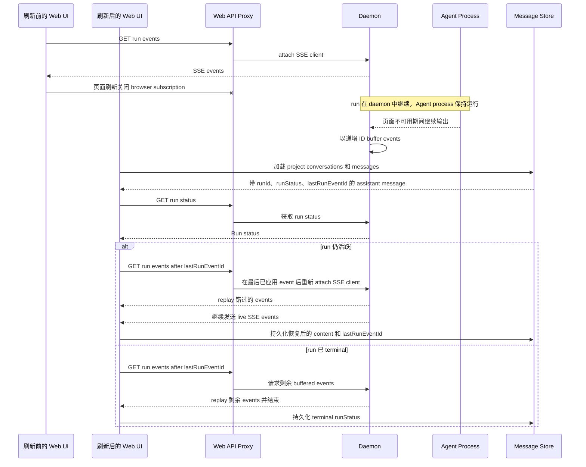
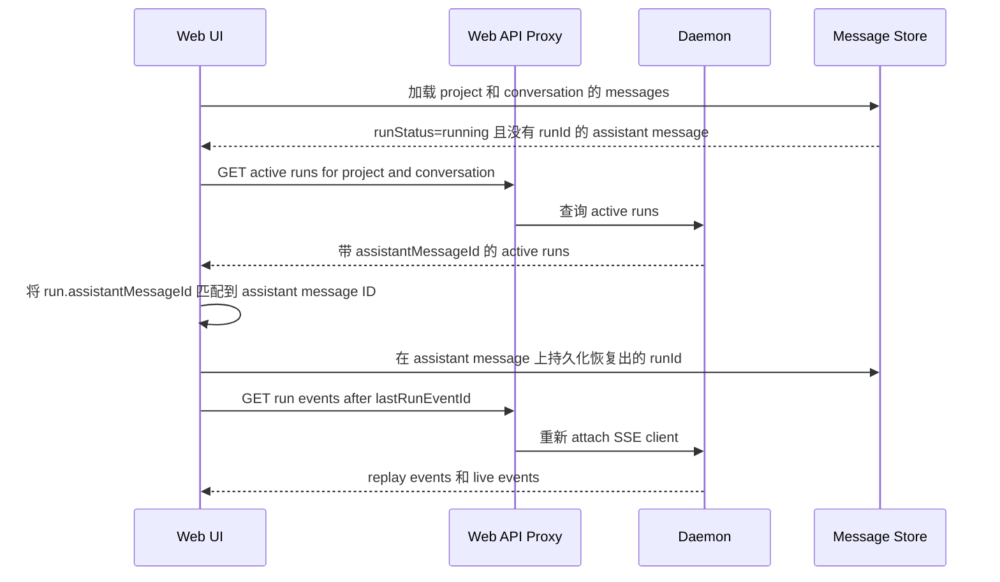
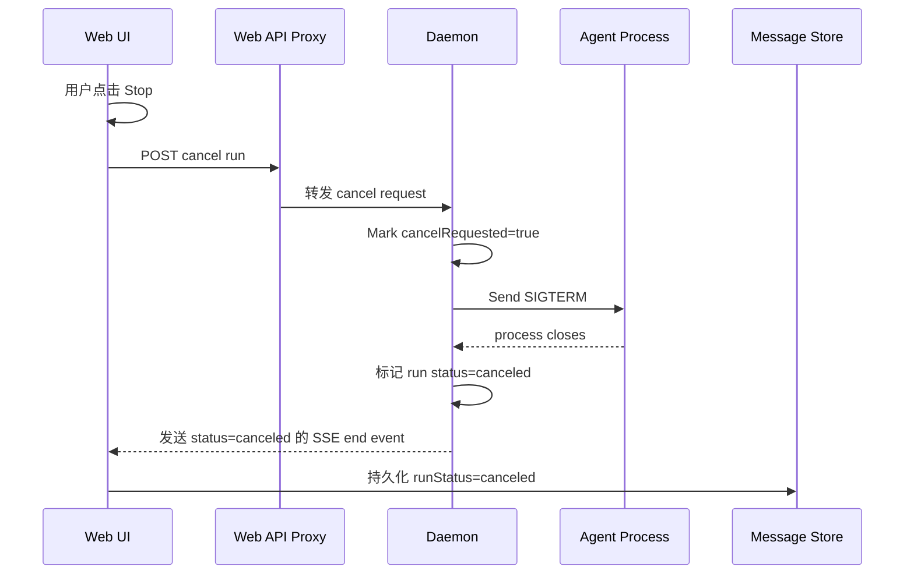

# Run Model 与恢复流程

## 目的

run 是由 daemon 拥有的后台执行实例，对应一次用户请求。它让 daemon 能在网页刷新、标签页关闭、路由切换和临时 SSE 断开之后，继续保留 Agent 任务。

frontend 拥有展示状态。daemon 拥有执行状态。SSE 拥有实时订阅与 replay。

## 概念模型

project 是顶层设计工作区。它包含 conversations，拥有 artifacts，并为 Agent 执行提供 daemon 工作目录。

conversation 是 project 内的一条 thread。它包含有序 messages，并为多轮工作提供 UI context。

message 是用户可见的对话内容。user message 记录请求。assistant message 记录生成结果，并且在生成仍活跃或可恢复时，可以由一个 run 支撑。

run 是 daemon 拥有的执行实例。它属于一个 project 和一个 conversation，并指向一个 assistant message。run 会启动并监督一个 Agent process，记录执行状态，并存储可 replay 的 SSE events。

预期基数关系如下：

- 一个 project 包含多个 conversations。
- 一个 conversation 包含多个 messages。
- 一个 project 可以有多个 runs。
- 一个 conversation 可以有多个 runs。
- 一个 assistant message 可以有零个或一个 run。
- 一个 run 属于一个 project、一个 conversation 和一个 assistant message。
- 一个 run 在活跃执行期间可以启动一个 Agent process。

恢复路径遵循用户可见的层级：打开 project，加载 conversation，找到带有活跃 run metadata 的 assistant messages，然后重新 attach 到 daemon run。

## 概念职责

### Project

project 是设计工作区。它提供：

- project metadata，例如 skill、design system 和 fidelity；
- daemon-managed project working directory。本 spec 不得定义 daemon data paths；记录 storage 前，先阅读根目录 [`AGENTS.md`](../../AGENTS.md) → **Daemon data directory contract**；
- artifact ownership；
- conversations 和 runs 的顶层 scope。

### Conversation

conversation 是 project 内的一条 thread。它提供：

- 有序 message history；
- 多轮工作的 UI context；
- 活跃 run 恢复所需的 grouping key。

### Message

message 是用户可见的对话内容。assistant message 同时也是 run result 的持久 UI 容器。它应存储：

- `runId`：支撑该 assistant response 的 daemon execution；
- `runStatus`：最新已知 run state；
- `lastRunEventId`：最近已应用的 SSE event ID；
- streaming 期间持久化的部分生成内容。

### Run

run 是 daemon 管理的执行实例。它提供：

- Agent process startup；
- 执行状态，例如 `queued`、`running`、`succeeded`、`failed` 或 `canceled`；
- 可 replay 的 SSE events；
- 通过 `events?after=<lastRunEventId>` 实现的 reconnect support；
- 通过 cancel endpoint 实现的显式取消。

每个 run 都应携带 `projectId`、`conversationId` 和 `assistantMessageId`。这些字段让 daemon 能为重新打开的 project page 恢复活跃工作，也让 frontend 能把输出附加到正确的 assistant message。

## 主通信流程



## 刷新与重新 attach 流程



## 活跃 Run fallback 流程

frontend 应在 run 创建后立刻把 `runId` 持久化到 assistant message 上。daemon run 创建和 message 更新之间仍存在一个很小的失败窗口。daemon 也应支持 active run list endpoint，作为恢复 fallback。



## 显式取消流程

browser subscription lifetime 与 daemon run lifetime 是分离的。刷新、关闭标签页和路由切换只会关闭本地 subscription。只有用户显式点击 Stop 时，daemon 才会收到 cancel request。



## API Surface

推荐的 run APIs：

```http
POST /api/runs
GET  /api/runs/:id
GET  /api/runs/:id/events?after=<lastRunEventId>
GET  /api/runs?projectId=<projectId>&conversationId=<conversationId>&status=active
POST /api/runs/:id/cancel
```

`POST /api/runs` 应接受 correlation fields：

```ts
interface ChatRunCreateRequest {
  projectId: string;
  conversationId: string;
  assistantMessageId: string;
  clientRequestId: string;
  agentId: string;
  message: string;
  model?: string | null;
  reasoning?: string | null;
}
```

`GET /api/runs/:id` 应返回足够用于恢复的 state：

```ts
interface ChatRunStatusResponse {
  id: string;
  projectId: string;
  conversationId: string;
  assistantMessageId: string;
  agentId: string;
  status: 'queued' | 'running' | 'succeeded' | 'failed' | 'canceled';
  createdAt: number;
  updatedAt: number;
  exitCode?: number | null;
  signal?: string | null;
}
```

## 持久化阶段

### Phase 1：刷新与关闭标签页后仍可存活

- 将 daemon runs 保存在内存中。
- 在 message store 中持久化 `runId`、`runStatus`、`lastRunEventId` 和部分 assistant content。
- 只要 daemon process 仍然存活，刷新后就可以重新 attach。
- 保留 terminal run metadata 和 event buffers 足够长时间，以支持短期 UI 恢复。

### Phase 2：daemon 重启后的可见性

- 在 daemon storage 中持久化 `chat_runs` 和 `chat_run_events`。
- daemon 重启后，将 active runs 标记为 interrupted，因为 child process 会随 daemon 退出。
- 保留 terminal status 和 buffered output，供用户可见 history 使用。

## 实现规则

- browser fetch abort 只应关闭本地 SSE subscription。
- Stop button 是唯一应调用 `/api/runs/:id/cancel` 的 UI action。
- The frontend should persist `runId` immediately after `POST /api/runs` succeeds.
- The frontend should process SSE events idempotently using `lastRunEventId`.
- The daemon should allow multiple simultaneous SSE clients for one run.
- The daemon should expose active runs by project and conversation for fallback recovery.
